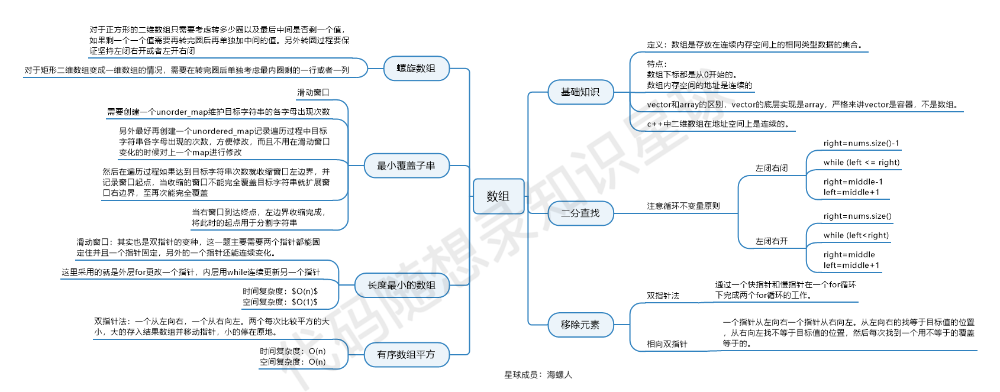

# 数组

## 基本概念

数组：**数组是存放在连续内存空间上的相同类型数据的集合。**

- **数组下标都是从0开始的。**
- **数组内存空间的地址是连续的**

**数组的元素是不能删的，只能覆盖。**

C++中二维数组的地址是连续的

```c++
#include <iostream>

int main()
{
    //1.二维数组的地址,C++中是连续分布的
    int array[2][3]= {
        {1,2,3},
        {4,5,6}
    };
    std::cout << "Array address:\n";
    std::cout << "array[0][0] = " << &array[0][0] << std::endl;
    std::cout << "array[0][1] = " << &array[0][1] << std::endl; 
    std::cout << "array[0][2] = " << &array[0][2] << std::endl;
    std::cout << "array[1][0] = " << &array[1][0] << std::endl;
    std::cout << "array[1][1] = " << &array[1][1] << std::endl;
    std::cout << "array[1][2] = " << &array[1][2] << std::endl;

    return 0;
}
```

结果：

```
Array address:
array[0][0] = 0x5ffe80
array[0][1] = 0x5ffe84
array[0][2] = 0x5ffe88
array[1][0] = 0x5ffe8c
array[1][1] = 0x5ffe90
array[1][2] = 0x5ffe94
```

## 相关算法

- 二分查找
- 移除元素
- 有序数组的平方
- 长度最小的子数组
- 螺旋矩阵2
- 区间和
- 开发商购买土地

### 1.二分查找

二分查找又称折半查找，通过判断中间值修改查找区间，定位查询元素的位置。

- 边界处理最为关键：默认使用左闭右闭的方法
- 区分最终的left和right节点的意义
- 为了避免越界问题，循环中要判断边界

```c++
#include <iostream>
#include <vector>

using namespace std;

class Solution {
public:
    vector<int> searchRange(vector<int>& nums, int target) 
    {
        int left = 0;
        int right = nums.size() -1 ;

        if(right == -1)
        {
            return { -1, -1};
        }

        int mid = searchmid(nums, target, left, right);
        if(mid == -1)
        {
            return { -1, -1};
        }
        
        if(nums.size() == 1)
        {
            return { mid, mid};
        }

        //扩大找左分界
        while(mid > 0 && nums[mid - 1] == target)
        {
            mid = searchmid(nums, target, 0, mid - 1);
        }

        left = mid;

        while(mid < right && nums[mid + 1] == target)
        {
            mid = searchmid(nums, target, mid + 1, right);
        }

        right = mid;

        return { left, right};
    }

    int searchmid(vector<int>& nums, int target, int left, int right) 
    {
        while(left <= right)
        {
            int mid = (left + right) / 2;

            if(nums[mid] > target)
            {
                right = mid - 1;
            }
            else if(nums[mid] < target)
            {
                left = mid + 1;
            }
            else return mid;
        }

        return -1;
    }
};

int main(int argc, char **argv)
{
    int ret = -1;
    Solution *so = new Solution();
    vector<int> vec = {2, 2, 2};
    vector<int> ret2 = so->searchRange(vec, 2);
    cout << "[" << ret2[0] << "," << ret2[1] << "]" << endl;
    return 0;
}
```


### 2.移除元素(快慢指针)

双指针法（快慢指针法）：**通过一个快指针和慢指针在一个for循环下完成两个for循环的工作。**

- 快指针：寻找新数组的元素 ，新数组就是不含有目标元素的数组
- 慢指针：指向更新 新数组下标的位置

```c++
#include <iostream>
#include <vector>
#include <string>

using namespace std;


//本题的重点是元素排列是有序的，取绝对值是两边往中间排序
//排序从大往小排序，比较左右节点的"绝对值"可以获取最大值。
class Solution {
public:
    vector<int> sortedSquares(vector<int>& nums) {
        vector<int> ans = nums;
        int left = 0;
        int lenth = nums.size();
        int right = lenth - 1;
        for(int i = lenth - 1; i >= 0; i--)
        {
            int x = nums[left] * nums[left];
            int y = nums[right] * nums[right];

            if(x > y)
            {
                ans[i] = x;
                left++; //更新节点找下一个最大值
            }
            else
            {
                ans[i] = y;
                right--;
            }
        }
        return ans;
    }
};

int main(int argc, char **argv)
{
    bool ret;
    Solution *so = new Solution();
    vector<int> vec = {-4,-1,0,3,10};
    vec = so->sortedSquares(vec);
    for(auto i : vec)
    {
        cout << i << " ";
    }
    return 0;
}

```

### 3.有序数组的平方

**使用双指针实现**：典型的双指针用法。

```c++
#include <iostream>
#include <vector>
#include <string>

using namespace std;


//本题的重点是元素排列是有序的，取绝对值是两边往中间排序
//排序从大往小排序，比较左右节点的"绝对值"可以获取最大值。
class Solution {
public:
    vector<int> sortedSquares(vector<int>& nums) {
        vector<int> ans = nums;
        int left = 0;
        int lenth = nums.size();
        int right = lenth - 1;
        for(int i = lenth - 1; i >= 0; i--)
        {
            int x = nums[left] * nums[left];
            int y = nums[right] * nums[right];

            if(x > y)
            {
                ans[i] = x;
                left++; //更新节点找下一个最大值
            }
            else
            {
                ans[i] = y;
                right--;
            }
        }
        return ans;
    }
};

int main(int argc, char **argv)
{
    bool ret;
    Solution *so = new Solution();
    vector<int> vec = {-4,-1,0,3,10};
    vec = so->sortedSquares(vec);
    for(auto i : vec)
    {
        cout << i << " ";
    }
    return 0;
}
```

### 4.长度最小的子数组(滑动窗口)

所谓滑动窗口，**就是不断的调节子序列的起始位置和终止位置，从而得出我们要想的结果**。滑动窗口也可以理解为双指针法的一种。

- 窗口的滑动是每次仅向前滑动一格
- 窗口的滑动更新也是在while循环里面进行的

```c++
#include <iostream>
#include <vector>
#include <string>
#include <stdint.h>

using namespace std;

class Solution {
public:
    int minSubArrayLen(int target, vector<int>& nums) {
        int left = 0;
        int lenth = 0;
        int sum = 0;
        int ret = INT32_MAX;
        for(int i = 0; i < nums.size(); i++)
        {
            sum += nums[i];
            while(sum >= target)
            {
                lenth = (i - left + 1); 
                ret = ret > lenth ? lenth : ret;
                sum -= nums[left++];    //先sum -= nums[left]再进行left++,变更滑动窗口起始位置
            }
        }
        return  ret == INT32_MAX ? 0 : ret;   
    }
};

int main(int argc, char **argv)
{
    int ret;
    Solution *so = new Solution();
    vector<int> vec = {2,3,1,2,4,3};
    ret = so->minSubArrayLen(7, vec);
    cout << ret << endl;
    return 0;
}
```


借鉴《代码随想录》的动画图。十分生动形象。

```c++
#include <iostream>
#include <vector>
#include <string>
#include <stdint.h>

using namespace std;

class Solution { 
public:
    int totalFruit(vector<int>& fruits) {
        int left = 0;
        vector<int> Count(fruits.size());   //某种水果采摘个数
        int kind = 0;
        int ans = 0;
        for(int i = 0; i < fruits.size(); i++)
        {
            if(Count[fruits[i]] == 0)
            {
                kind++;
            }

            Count[fruits[i]]++;

            while(kind > 2)
            {
                Count[fruits[left]]--;  //向前滑动
                if(Count[fruits[left]] == 0)
                {
                    kind--;
                }
                left++; //窗口是每次向前滑动一格
            }

            ans = max(ans, i - left + 1);
        }

        return ans;
    }
};

int main(int argc, char **argv)
{
    int ret;
    Solution *so = new Solution();
    vector<int> vec = {1,0,29,29,29,29,29,29,0,0,29,8,8,29,8,29,8,8,15,8,8,15,15,8,15,15,8,8,7,5};
    ret = so->totalFruit(vec);
    cout << ret << endl;
    return 0;
}
```

### 5.螺旋矩阵(过程模拟)

- 过程模拟的题目关键点：边界处理，坚持**循环不变量原则**
- 边界条件要统一

```c++
#include <iostream>
#include <vector>
#include <string>
#include <stdint.h>

using namespace std;

//循环不变量原则，循环的区间里面的值不能改变。
//边界条件统一
class Solution {
public:
    vector<vector<int>> generateMatrix(int n) {
        vector<vector<int>> ret(n, vector<int>(n, 0));
        int startx = 0; int starty = 0;
        int loop = n / 2;   //循环次数，n为奇数中间为一格空格
        int mid = n / 2;
        int count = 1;  //计数器
        int offset = 1; //遍历每条边的偏移量
        int i,j;
        while(loop--)
        {
            i = startx;
            j = starty;

            //模拟填充上边(左闭右开)
            for(j; j < n - offset; j++)
            {
                ret[i][j] = count++;
            }

            //模拟填充右边(左闭右开)
            for(i; i < n - offset; i++)
            {
                ret[i][j] = count++;
            }

            //模拟填充下边(左闭右开)
            for(j; j > startx; j--)
            {
                ret[i][j] = count++;
            }

            //模拟填充左边(左闭右开)
            for(i; i > startx; i--)
            {
                ret[i][j] = count++;
            }

            //执行完一圈，更新控制参数
            offset++;
            startx++;
            starty++;
        }

        if(n % 2)
        {
            ret[mid][mid] = count;
        }

        return ret;
    }
};

int main(int argc, char **argv)
{
    int ret;
    vector<vector<int>> ans;
    Solution *so = new Solution();
    ans = so->generateMatrix(3);
    for(auto i : ans)
    {
        for(auto j : i)
        {
            cout << j << "\t";
        }
        cout << "\n";
    }
    return 0;
}
```

```c++
#include <iostream>
#include <vector>
#include <string>
#include <stdint.h>

using namespace std;

class Solution {
public:
    vector<int> spiralOrder(vector<vector<int>>& matrix) {
        vector<int> ans;
        if(matrix.empty())
            return ans;
        int u = 0;  //上边界
        int d = matrix.size() - 1;  //下边界
        int l = 0;  //左边界
        int r = matrix[0].size() - 1;   //右边界
        while(true)
        {
            //上行从左往右，遍历结束后更新u节点
            for(int i = l; i <= r; i++) ans.push_back(matrix[u][i]);
            if(++u > d) break;

            //右行从上往下，遍历结束后更新r节点
            for(int i = u; i <= d; i++) ans.push_back(matrix[i][r]);
            if(--r < l) break;

            //下行从右往左，遍历结束后更新d节点
            for(int i = r; i >= l; i--) ans.push_back(matrix[d][i]);
            if(--d < u) break;

            //左行从下往上，遍历结束后更新l节点
            for(int i = d; i >= u; i--) ans.push_back(matrix[i][l]);
            if(++l > r) break;
        }
        
        return ans;
    }
};

int main(int argc, char **argv)
{
    vector<int> ret;
    vector<vector<int>> vec = {{1,2,3},{4,5,6},{7,8,9}};
    Solution *so = new Solution();
    ret = so->spiralOrder(vec);
    for(auto i : ret)
    {
        cout << i << " ";
    }
    return 0;
}
```

### 6.区间和(前缀和)

-  前缀和就是使用额外的空间记录数组前缀的累加，在重复遍历统计的场景下可以节省重新遍历的时间
- 注意区间为[0, x]的处理
- 注意统计[a,b]是计算p(b) - p(a - 1)

```
#include <iostream>
#include <vector>
#include <string>
#include <stdint.h>

using namespace std;

int main(int argc, char **argv)
{
    int n;
    cin >> n;
    vector<int> vec(n);
    vector<int> st(n);
    int sum = 0;
    for(int i = 0; i < n; i++)
    {
        cin >> vec[i];
        sum += vec[i];
        st[i] = sum;
    }

    int a, b;
    while(cin >> a >> b)
    {
        if(a == 0 && b == 0) break;
        if(a == 0)
        {
            cout << st[b] << endl;
        }
        else
        {
            cout << st[b] - st[a - 1] << endl;
        }    
    }

    return 0;

}
```

### 总结

目前数组相关解题方法：二分查找、快慢指针、双指针、滑动窗口、过程模拟和前缀和

- 数组相关的算法关键是边界条件的处理，尽量避免在循环中过度修改遍历的元素的值，会造成很多边界问题。
- 在解题时需要模拟运行一遍，明确接下来的解题方法。在遇到边界条件处理时需要再次结合模拟过程进行判断。
- 如果在写代码解题时需要处理很多边界条件，很可能是重复处理边界条件了，或者解题方向错了



这个图是 [代码随想录知识星球 (opens new window)](https://programmercarl.com/other/kstar.html)成员：[海螺人 (opens new window)](https://wx.zsxq.com/dweb2/index/footprint/844412858822412)，所画，总结的非常好，在此借鉴一下。

📝：2024-10-10-23:00 第一次刷完数组部分算法题


