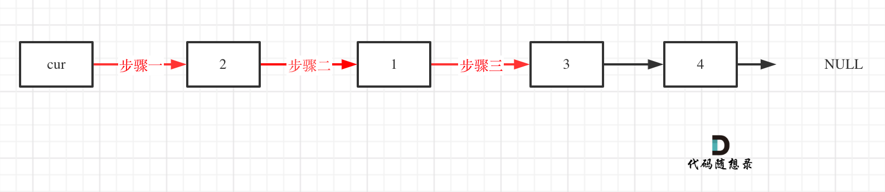

# 链表

## 基本概念

#### 了解链表

链表是一种通过指针串联在一起的线性结构，每一个节点由两部分组成，一个是数据域一个是指针域（存放指向下一个节点的指针），最后一个节点的指针域指向null（空指针的意思）。链表的入口节点称为链表的头结点也就是head。

单链表


------

双链表


循环链表：循环链表，顾名思义，就是链表首尾相连。循环链表可以用来**解决约瑟夫环问题**。

#### 定义链表

```c++
// 单链表
struct ListNode {
    int val;  // 节点上存储的元素
    ListNode *next;  // 指向下一个节点的指针
    ListNode(int x) : val(x), next(NULL) {}  // 节点的构造函数
};

//使用
ListNode* head = new ListNode(5);
```

#### 初始化链表

```c++
#include <iostream>
#include <cmath>
using namespace std;

struct ListNode {
    int val;    //节点上的元素
    ListNode *next; //指向下一个节点的指针
    ListNode(int x) : val(x), next(nullptr) {}
    ListNode(int x, ListNode *next) : val(x), next(next) {}
};

ListNode* creatList(int a[], int n)
{
    ListNode *head = new ListNode(a[0]);
    ListNode *temp = head;

    for(int i = 1; i < n; i++)
    {
        ListNode *newNode = new ListNode(a[i]);
        temp->next = newNode;
        temp = newNode;
    }

    return head;
}

int main(int argc, char **argv)
{
    int a[]{1, 2, 6, 3, 4, 5, 6}; 
    ListNode *head = creatList(a, 7);
    while(head)
    {
        cout << head->val << " ";
        head = head->next;
    }
    return 0;
}
```

#### 性能分析


链表的增删改的效率高：因为链表可以直接插入和删除元素，数组不能直接删除元素。需要通过修改其他元素位置来实现删除/插入

## 相关算法

- 移除链表元素
- 设计链表
- 翻转链表
- 两两交换链表中的节点
- 删除链表的倒数第N个节点
- 链表相交
- 环形链表

#### 移除链表元素

- c++需要手动释放移除链表的内存：使用temp记录移除链表的元素地址
- 循环判断条件是**当前节点**和**下一个节**点都不为空
- 循环中判断的是cur->next->val == val，是当前节点的下一个节点的值。
- 循环处理中注意使用else cur = cur->next;若每次循环都cur = cur->next会跳过连续需要删除的节点，比如[0,7,7,7,7]会变成[0,7,7]

```c++
#include <iostream>
#include <cmath>
using namespace std;

struct ListNode {
    int val;    //节点上的元素
    ListNode *next; //指向下一个节点的指针
    ListNode(int x) : val(x), next(nullptr) {}
    ListNode(int x, ListNode *next) : val(x), next(next) {}
};

//使用需要头节点，处理需要删除头节点的情况。(使原来的头节点变成非头节点)
class Solution {
public:
    ListNode* removeElements(ListNode* head, int val) {
        ListNode *dummyHead = new ListNode(0, head);
        ListNode *cur = dummyHead;   //当前节点
        while(cur != NULL && cur->next != NULL)
        {
            if(cur->next->val == val)
            {
                ListNode *temp = cur->next;
                cur->next = cur->next->next;
                delete temp;
            }
            else cur = cur->next; 
        }

        return dummyHead->next;
    }
};

ListNode* creatList(int a[], int n)
{
    ListNode *head = new ListNode(a[0]);
    ListNode *temp = head;

    for(int i = 1; i < n; i++)
    {
        ListNode *newNode = new ListNode(a[i]);
        temp->next = newNode;
        temp = newNode;
    }

    return head;
}

int main(int argc, char **argv)
{
    int a[]{1, 2, 6, 3, 4, 5, 6}; 
    ListNode *head = creatList(a, 7);
    Solution *so = new Solution();
    ListNode *ans = so->removeElements(head, 6);
    while(ans)
    {
        cout << ans->val << " ";
        ans = ans->next;
    }
    return 0;
}
```

#### 设计链表

- 使用虚拟头节点可以避免很多需要特判的情况，因为链表一定有且仅有一个头节点(虚拟头节点)
- ListNode *cur = dummyHead; index-- 最终cur是下标为index的前一个节点。
- ListNode *cur = dummyHead->next; index-- 最终cur是下标为index节点。
- 避免循环中使用while(cur != NULL) { cur->next->val;},会造成越界问题。
- delete一个节点后一定要设置为nullptr，避免产生野指针。

```c++
#include <iostream>
#include <cmath>
using namespace std;

class MyLinkedList {
public:
    struct ListNode {
        int val;    //节点上的元素
        ListNode *next; //指向下一个节点的指针
        ListNode(int x) : val(x), next(nullptr) {}
        ListNode(int x, ListNode *next) : val(x), next(next) {}
    };

    MyLinkedList() {
        dummyHead = new ListNode(0);
        _size = 0;
    }
    
    int get(int index) {
        if(index > (_size - 1) || index < 0)
        {
            return -1;
        }
        ListNode *cur = dummyHead->next;
        //后缀--表达式计算完再--
        while(index--) cur = cur->next;
        return cur->val;
    }
    
    void addAtHead(int val) {
        ListNode *newNode = new ListNode(val,dummyHead->next);
        dummyHead->next = newNode;
        _size++;
    }
    
    void addAtTail(int val) {
        ListNode *newNode = new ListNode(val);
        ListNode *cur = dummyHead;
        while(cur->next != nullptr) cur = cur->next;
        cur->next = newNode;
        _size++;
    }
    
    void addAtIndex(int index, int val) {
        if(index > _size) return;
        if(index == _size)
        {
            addAtTail(val);
            return;
        }
        if(index < 0) index = 0;
        ListNode *newNode = new ListNode(val);
        ListNode *cur = dummyHead;
        while(index--)
        {
            cur = cur->next;
        }
        newNode->next = cur->next;
        cur->next = newNode;
        _size++;
        
        return;
    }
    
    void deleteAtIndex(int index) {
        if(index >= _size || index < 0) return;
        ListNode *cur = dummyHead;
        while(index--)
        {
            cur = cur->next;
        }
        ListNode *temp = cur->next;
        cur->next = cur->next->next;
        delete temp;
        temp = nullptr; //避免产生野指针
        _size--;
        
        return;
    }

    void printList()
    {
        ListNode *cur = dummyHead;
        while(cur->next != nullptr)
        {
            cout << cur->next->val << " ";
            cur = cur->next;
        }
        cout << endl;
    }

private:
    int _size;
    ListNode *dummyHead;
};

int main(int argc, char **argv)
{
    MyLinkedList *myLinkedList = new MyLinkedList();
    myLinkedList->printList();
    myLinkedList->addAtHead(7);
    myLinkedList->addAtHead(2);
    myLinkedList->addAtHead(1);
    myLinkedList->printList();
    myLinkedList->addAtIndex(3,0);
    myLinkedList->printList();
    myLinkedList->deleteAtIndex(2);
    myLinkedList->printList();
    myLinkedList->addAtHead(6);
    myLinkedList->addAtTail(4);
    myLinkedList->get(4);
    myLinkedList->printList();
    myLinkedList->deleteAtIndex(4);
    myLinkedList->addAtHead(4);
    myLinkedList->addAtIndex(5,0);
    myLinkedList->addAtHead(6);
    myLinkedList->printList();

    return 0;
}
```

#### 翻转链表(双指针法)

- 使用pre记录上一个节点
- 使用temp保存cur->next
- 更新节点
- 因为没有使用额外的空间存储新的链表,**原来是链表head节点变成了最后一个节点**，失去了head节点的功能。


```c++
#include <iostream>
#include <cmath>
using namespace std;

struct ListNode {
    int val;    //节点上的元素
    ListNode *next; //指向下一个节点的指针
    ListNode(int x) : val(x), next(nullptr) {}
    ListNode(int x, ListNode *next) : val(x), next(next) {}
};

class Solution {
public:
    ListNode* reverseList(ListNode* head) {
        ListNode *temp = nullptr;
        ListNode *pre = nullptr;
        ListNode *cur = head;
        while(cur != nullptr)
        {
            temp = cur->next;   //修改cur->next前先保存一下
            cur->next = pre;
        
            //更新
            pre = cur;
            cur = temp;
        }

        return pre;
    }
};

ListNode* creatList(int a[], int n)
{
    ListNode *head = new ListNode(a[0]);
    ListNode *temp = head;

    for(int i = 1; i < n; i++)
    {
        ListNode *newNode = new ListNode(a[i]);
        temp->next = newNode;
        temp = newNode;
    }

    return head;
}

void printList(ListNode *list)
{
    ListNode *cur = list;
    while(cur != nullptr)
    {
        cout << cur->val << " ";
        cur = cur->next;
    }
    cout << endl;
}

int main(int argc, char **argv)
{
    int a[]{1, 2, 3, 4, 5, 6, 7}; 
    ListNode *head = creatList(a, 7);
    printList(head);
    Solution *so = new Solution();
    ListNode * ret = so->reverseList(head);
    printList(ret);
    return 0;
}
```

递归实现

- 递归结束条件:cur->next == NULL
- 递归内部:改变cur、pre节点的执行，更新cur、pre节点
- 此时递归的本质是不断循环遍历链表，直到超出边界条件。

```c++
//递归实现
#include <iostream>
#include <cmath>
using namespace std;

struct ListNode {
    int val;    //节点上的元素
    ListNode *next; //指向下一个节点的指针
    ListNode(int x) : val(x), next(nullptr) {}
    ListNode(int x, ListNode *next) : val(x), next(next) {}
};

class Solution {
public:
    ListNode* reverseList(ListNode* head) {
        return reverse(NULL, head);
    }

    ListNode* reverse(ListNode *pre, ListNode *cur)
    {
        if(cur == NULL) return pre;
        ListNode *temp = cur->next;
        cur->next = pre;
        
        return reverse(cur, temp);
    }
};

ListNode* creatList(int a[], int n)
{
    ListNode *head = new ListNode(a[0]);
    ListNode *temp = head;

    for(int i = 1; i < n; i++)
    {
        ListNode *newNode = new ListNode(a[i]);
        temp->next = newNode;
        temp = newNode;
    }

    return head;
}

void printList(ListNode *list)
{
    ListNode *cur = list;
    while(cur != nullptr)
    {
        cout << cur->val << " ";
        cur = cur->next;
    }
    cout << endl;
}

int main(int argc, char **argv)
{
    int a[]{1, 2, 3, 4, 5, 6, 7}; 
    ListNode *head = creatList(a, 7);
    printList(head);
    Solution *so = new Solution();
    ListNode * ret = so->reverseList(head);
    printList(ret);
    return 0;
}
```

#### 两两交换链表中的节点(过程模拟)

- 过程模拟：画图分析过程。
- 三步骤技巧：按照原来节点顺序更新节点的next, 0 1 2 



```c++
#include <iostream>

using namespace std;

struct ListNode {
    int val;
    ListNode *next;
    ListNode(int val) : val(val), next(nullptr) {}
    ListNode(int val, ListNode *next) : val(val), next(next) {}
};

class Solution {
public:
    ListNode* swapPairs(ListNode* head) {
        ListNode *dummyHead = new ListNode(0, head);
        ListNode *cur = dummyHead;
        while(cur->next != nullptr && cur->next->next != nullptr)
        {
            ListNode *temp1 = cur->next; //1号节点
            ListNode *temp2 = cur->next->next;  //2号节点

            //技巧：按照原来节点顺序更新节点的next, 0 1 2  
            cur->next = temp2;  //步骤1
            temp1->next = temp2->next;  //步骤2  
            temp2->next = temp1;    //步骤3

            //更新,一次更新两个节点
            cur = cur->next->next;
        }

        return dummyHead->next;
    }
};

ListNode* creatList(int a[], int n)
{
    ListNode *head = new ListNode(a[0]);
    ListNode *temp = head;
    for(int i = 1; i < n; i++)
    {
        ListNode *newNode = new ListNode(a[i]);
        temp->next = newNode;
        temp = newNode;
    }

    return head;
}

void printList(ListNode *list)
{
    ListNode *cur = list;
    while(cur != nullptr)
    {
        cout << cur->val << " ";
        cur = cur->next;
    }
    cout << endl;
}

int main(int argc, char **argv)
{
    int a[]{1,2,3,4,5,6};
    ListNode *test = creatList(a, sizeof(a) / sizeof(int));
    Solution *so = new Solution();
    ListNode *ret = so->swapPairs(test);
    printList(ret);
    return 0;
}
```

#### 删除倒数第N个节点(快慢指针)

- 要求：只遍历一遍链表实现功能
- 思路：快指针比慢指针先走n+1步，当快指针为nullptr时，slow指针刚好指向需要删除节点的前一个节点

```c++
#include <iostream>

using namespace std;

struct ListNode {
    int val;
    ListNode *next;
    ListNode(int val) : val(val), next(nullptr) {}
    ListNode(int val, ListNode *next) : val(val), next(next) {}
};

class Solution {
public:
    ListNode* removeNthFromEnd(ListNode* head, int n) {
        ListNode *dummyHead = new ListNode(0, head);
        ListNode *fast = dummyHead;
        ListNode *slow = dummyHead;
        while(fast != nullptr)
        {
            fast = fast->next;
            if(n < 0)
            {
                slow = slow->next;
            }
            n--;
        }
        ListNode *temp = slow->next;
        slow->next = temp->next;
        delete temp;
        temp = nullptr;

        return dummyHead->next;
    }
};

ListNode* creatList(int a[], int n)
{
    ListNode *head = new ListNode(a[0]);
    ListNode *temp = head;
    for(int i = 1; i < n; i++)
    {
        ListNode *newNode = new ListNode(a[i]);
        temp->next = newNode;
        temp = newNode;
    }

    return head;
}

void printList(ListNode *list)
{
    ListNode *cur = list;
    while(cur != nullptr)
    {
        cout << cur->val << " ";
        cur = cur->next;
    }
    cout << endl;
}

int main(int argc, char **argv)
{
    int a[]{1,2,3,4,5,6};
    ListNode *test = creatList(a, sizeof(a) / sizeof(int));
    Solution *so = new Solution();
    ListNode *ret = so->removeNthFromEnd(test, 2);
    printList(ret);
    return 0;
}
```

#### 链表相交

- 关键是先右对齐两个链表
- 计算差值，对齐链表。对齐后同时遍历，比较**地址**是否相同


```c++
#include <iostream>

using namespace std;

struct ListNode {
    int val;
    ListNode *next;
    ListNode(int val) : val(val), next(nullptr) {}
    ListNode(int val, ListNode *next) : val(val), next(next) {}
};

class Solution {
public:
    ListNode *getIntersectionNode(ListNode *headA, ListNode *headB) {
        ListNode *curA = headA;
        ListNode *curB = headB;
        int lenA = 0, lenB = 0;
        while(curA != nullptr)
        {
            lenA++;
            curA = curA->next;
        }

        while(curB != nullptr)
        {
            lenB++;
            curB = curB->next;
        }
		
        //重新赋值
        curA = headA;
        curB = headB;

        if(lenB > lenA)
        {
            swap(lenA, lenB);
            swap(curA, curB);
        }

        int gap = lenA - lenB;
        while(gap--)  curA = curA->next;

        while(curA != nullptr)
        {
            if(curA == curB) return curA;
            curA = curA->next;
            curB = curB->next;
        }

        return nullptr;
    }
};

ListNode* creatList(int a[], int n)
{
    ListNode *head = new ListNode(a[0]);
    ListNode *temp = head;
    for(int i = 1; i < n; i++)
    {
        ListNode *newNode = new ListNode(a[i]);
        temp->next = newNode;
        temp = newNode;
    }

    return head;
}

void printList(ListNode *list)
{
    ListNode *cur = list;
    while(cur != nullptr)
    {
        cout << cur->val << " ";
        cur = cur->next;
    }
    cout << endl;
}

//创建相交的链表
void createIntersectingLists(ListNode *headA, int valueA, ListNode *headB, int valueB ) {
    ListNode *curA = headA;
    ListNode *curB = headB;

    valueA--;
    valueB--;
    while(valueA--) curA = curA->next;
    while(valueB--) curB = curB->next;
    curB->next = curA->next;    
}


int main(int argc, char **argv)
{
    int a[]{4,1,8,4,5};
    int b[]{5,0,1,8,4,5};
    ListNode *test1 = creatList(a, sizeof(a) / sizeof(int));
    ListNode *test2 = creatList(b, sizeof(b) / sizeof(int));
    createIntersectingLists(test1, 2, test2, 3);
    Solution *so = new Solution();
    ListNode *ret = so->getIntersectionNode(test1, test2);
    printList(ret);
    return 0;
}
```

#### 环形链表2(快慢指针和数学逻辑推导)

- 判断链表是否有环:fast 走两个节点，slow走一个节点，有环的话，一定会在环内相遇.因为：

  1️⃣**fast指针一定先进入环中，如果fast指针和slow指针相遇的话，一定是在环中相遇，这是毋庸置疑的。**

  2️⃣**相对于slow来说，fast是一个节点一个节点的靠近slow的**，所以fast一定可以和slow重合。

  

- 找到这个环的入口:参考[代码随想录 (programmercarl.com)](https://www.programmercarl.com/0142.环形链表II.html#思路)

- 结论：**从头结点出发一个指针，从相遇节点 也出发一个指针，这两个指针每次只走一个节点， 那么当这两个指针相遇的时候就是 环形入口的节点**。


```c++
#include <iostream>

using namespace std;

struct ListNode {
    int val;
    ListNode *next;
    ListNode(int val) : val(val), next(nullptr) {}
    ListNode(int val, ListNode *next) : val(val), next(next) {}
};

class Solution {
public:
    ListNode *detectCycle(ListNode *head) {
        ListNode *fast = head;
        ListNode *slow= head;
        while(fast != nullptr && fast->next != nullptr)
        {
            fast = fast->next->next;
            slow = slow->next;

            if(fast == slow)
            {
                ListNode *index1 = fast;    //相遇节点
                ListNode *index2 = head;    //头节点
                while(index1 != index2)
                {
                    index1 = index1->next;
                    index2 = index2->next;
                }

                return index1; 
            }
        }

        return nullptr;
    }
};

ListNode* creatList(int a[], int n)
{
    ListNode *head = new ListNode(a[0]);
    ListNode *temp = head;
    for(int i = 1; i < n; i++)
    {
        ListNode *newNode = new ListNode(a[i]);
        temp->next = newNode;
        temp = newNode;
    }

    return head;
}

void printList(ListNode *list)
{
    ListNode *cur = list;
    while(cur != nullptr)
    {
        cout << cur->val << " ";
        cur = cur->next;
    }
    cout << endl;
}

void createCycleList(ListNode *head, int index)
{
    ListNode *flag = head;
    ListNode *cur = head;
    while(cur->next != nullptr)
    {
        if(index > 0)
        {
            index--;
            flag = cur;
        }
        cur = cur->next;
    } 

    cur->next = flag;
}

int main(int argc, char **argv)
{
    int a[]{3,2,0,-4};
    ListNode *test1 = creatList(a, sizeof(a) / sizeof(int));
    createCycleList(test1, 1);
    Solution *so = new Solution();
    ListNode *ret = so->detectCycle(test1);
    printList(ret);
    return 0;
}
```

#### 总结

参考：[代码随想录 (programmercarl.com)](https://www.programmercarl.com/链表总结篇.html#链表的理论基础)

代码随想录总结写得太好了。

📝：2024-10-12-22:00第一次刷完链表相关题目