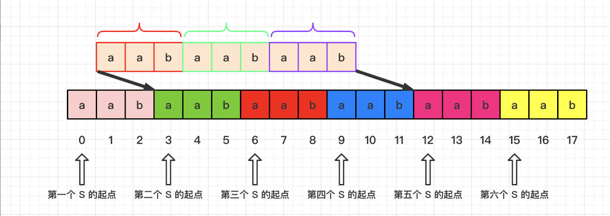

# 字符串

### 基本概念

- 字符串也是一种数组，所以元素在内存中是**连续分布**

- string相关常用函数
  - resize()
  - reverse()  翻转
  - find()   查找子串
  - spit()   分割

### 相关算法

- 翻转字符串
- 翻转字符串2
- 替换数字
- 翻转字符串里的单词
- 右旋转字符串
- 实现strStr()
- 重复的字字符串

#### 翻转字符串

- 字符串也是一种数组，所以元素在内存中是**连续分布**
- 可以使用**algorithm库**里面的**reverse**函数实现
- 自己实现思路：双指针，从两边往中间靠。交换头指针与尾指针

```c++
#include <iostream>
#include <vector>
#include <algorithm>    //resever
#include <string>

using namespace std;

class Solution {
public:
    void reverseString(vector<char>& s) {
        for(int i = 0, j = s.size() - 1; i < j; i++, j--)
        {
            swap(s[i], s[j]);
        }
    }
};

int main(int argc, char **argv)
{
    string s = "hello world";
    reverse(s.begin(), s.end());   //algorithm库里面
    cout << s << endl;
    vector<char> vec{'h','e','l', 'l', 'o'};
    Solution *so = new Solution();
    so->reverseString(vec);
    for( auto i : vec)
    {
        cout << i << " ";
    }
    cout << endl;
    return 0;
}
```

#### 翻转字符串2

- reverse()函数的使用
- 统一循环边界

```c++
#include <iostream>
#include <vector>
#include <algorithm>    //resever
#include <string>

using namespace std;

class Solution {
public:
    string reverseStr(string s, int k) {
        for(int i = 0; i < s.size(); i += (2 * k))
        {
            if(i + k <= s.size())
            {
                reverse(s.begin() + i, s.begin() + i + k);
            }
            else
            {   //剩下情况需要翻转的字符串少于k，直接翻转剩下的字符串
                //剩下的情况都需要执行下面的语句，而且for()会自动i += (2 * k)，退出
                reverse(s.begin() + i, s.end());
            }
        }
        return s;
    }
};

int main(int argc, char **argv)
{
    string s = "abcdefg";
    Solution *so = new Solution();
    s = so->reverseStr(s, 2);
    cout << s << endl;
    return 0;
}
```

#### 替换数字

- resize()函数的使用，可以扩充字符串长度
- 双指针从后面向前遍历，因为已经知道字符串的长度了。不需要额外的辅助空间去进行存储移动元素。
- 字符串和数组的区别，char a[5] = "asd"; a[3] = '\0'，是结束符。

```c++
#include <iostream>
#include <vector>
#include <algorithm>    //resever
#include <string>

using namespace std;

class Solution {
public:
    string reverseStr(string s) {
        int sOldIndex = s.size() - 1;   //未扩充前的下标
        int count = 0;
        for(auto i : s)
        {
            if(i >= '0' && i <= '9')
                count++;
        }

        //关键点：resize的使用
        s.resize(s.size() + count * 5);
        int newIndex = s.size() - 1;
        while(sOldIndex >= 0)   //0不能漏掉
        {
            if(s[sOldIndex] >= '0' && s[sOldIndex] <= '9')
            {
                //number
                s[newIndex--] = 'r';
                s[newIndex--] = 'e';
                s[newIndex--] = 'b';
                s[newIndex--] = 'm';
                s[newIndex--] = 'u';
                s[newIndex--] = 'n';
            }else
            {
                s[newIndex--] = s[sOldIndex];
            }
            sOldIndex--;
        }

        return s;
    }
};

int main(int argc, char **argv)
{
    string s;
    cin >> s;
    Solution *so = new Solution();
    s = so->reverseStr(s);
    cout << s << endl;
    return 0;
}
```

#### 翻转字符串里面的单词

- **去除多余空格、翻转整个字符串、翻转单词**
- **去除多余空格**：除了第一个单词、每个新单词前面手动添加一个空格
- 可以使用spit分割单词(时间复杂度会高很多)

```c++
#include <iostream>
#include <vector>
#include <algorithm>    //resever
#include <string>

using namespace std;

class Solution {
public:
    string reverseWords(string s) {
        //1.清楚空格
        clearSpace(s);
        //2.字符串翻转
        reverseString(s, 0, s.size() - 1);
        //3.翻转字符串
        int start = 0;
        for(int i = 0; i <= s.size(); i++)
        {
            if(s[i] == ' ' || i == s.size())
            {
                reverseString(s, start, i - 1);
                start = i + 1;
            }
        }

        return s;
    }

    //左闭右闭
    void reverseString(string &s, int start, int end) {
        for(int i = start, j = end; i < j; i++, j--)
        {
            swap(s[i], s[j]);
        }
    }

    void clearSpace(string &s)
    {
        int slow = 0;
        for(int i = 0; i < s.size(); i++)
        {
            if(s[i] != ' ')
            {
                if(slow != 0)   s[slow++] = ' ';    //在单词前面手动添加空格，除了第一个单词
                while(i < s.size() && s[i] != ' ')
                {
                    s[slow++] = s[i++];
                }
            }
        }

        s.resize(slow);
    }
};

int main(int argc, char **argv)
{
    string s = "the sky is blue";
    Solution *so = new Solution();
    s = so->reverseWords(s);
    cout << s << endl;

    return 0;
}
```

#### 右旋转字符串

- **不能申请额外空间，只能在本串上操作**
- 实现的思路是整体翻转加两次分段翻转

```c++
#include <iostream>
#include <vector>
#include <algorithm>    //resever
#include <string>

using namespace std;

class Solution {
public:
    string rightReverseStr(string s, int k) {
        reverseString(s, 0, s.size() - 1);
        reverseString(s, 0, k - 1);
        reverseString(s, k, s.size() - 1);
        
        return s;
    }

    //左闭右闭
    void reverseString(string &s, int start, int end) {
        for(int i = start, j = end; i < j; i++, j--)
        {
            swap(s[i], s[j]);
        }
    }
};

int main(int argc, char **argv)
{
    int k;
    string s;
    cin >> k >> s; 
    Solution *so = new Solution();
    s = so->rightReverseStr(s, k);
    cout << s << endl;

    return 0;
}
```

#### 实现 strStr()-(KMP 经典题目)

- KMP的经典思想就是：**当出现字符串不匹配时，可以记录一部分之前已经匹配的文本内容，利用这些信息避免从头再去做匹配。**
- **next数组(前缀表)**：记录已经匹配的文本内容，是KMP的重点，也是next数组肩负的重任，**next数组既可以就是前缀表，也可以是前缀表统一减一**
- **前缀表**：**前缀表是用来回退的，它记录了模式串与主串(文本串)不匹配的时候，模式串应该从哪里开始重新匹配。**
- **最长公共前后缀**：**前缀是指不包含最后一个字符的所有以第一个字符开头的连续子串**。**后缀是指不包含第一个字符的所有以最后一个字符结尾的连续子串**。
  - **前缀表要求的就是相同前后缀的长度。**字符串a的最长相等前后缀为0。 字符串aa的最长相等前后缀为1。 字符串aaa的最长相等前后缀为2


##### 如何计算前缀表


例子："aabaa" 前缀："a"、"aa"、"aab"、"aaba"；后缀："a"、"aa"、"baa"、"abaa",最长公共前后缀"aa",长度为2

##### 构造next数组

**next数组既可以就是前缀表，也可以是前缀表统一减一（右移一位，初始位置为-1）**

**构造next数组其实就是计算模式串s，前缀表的过程。** 主要有如下三步：

- 初始化
- 处理前后缀不相同的情况
- 处理前后缀相同的情况

```c++
void getNext(int *next, const string& s)
{
    //1.初始化
    int j = -1;     //j指向前缀末尾位置，i指向后缀末尾位置。
    next[0] = j;    //前缀表统一减一的记录方法


    for(int i = 1; i < s.size(); i++)
    {   
        //2.处理前后缀不同的前况
        while(j >= 0 && s[i] != s[j + 1])
            j = next[j];    //向前回退

        //3.处理前后缀相同的情况
        if(s[i] == s[j + 1])
        {
            j++;
        }
        next[i] = j;
    }
}
```

------

```c++
#include <iostream>
#include <vector>
#include <algorithm>    //resever
#include <string>

using namespace std;

class Solution {
public:
    void getNext(int *next, const string& s)
    {
        //1.初始化
        int j = -1;     //j指向前缀末尾位置，i指向后缀末尾位置。
        next[0] = j;    //前缀表统一减一的记录方法

        
        for(int i = 1; i < s.size(); i++)
        {   
            //2.处理前后缀不同的前况
            while(j >= 0 && s[i] != s[j + 1])
                j = next[j];    //向前回退

            //3.处理前后缀相同的情况
            if(s[i] == s[j + 1])
            {
                j++;
            }
            next[i] = j;
        }
    }

    int strStr(string haystack, string needle) {
        if(needle.size() == 0) return 0;
        vector<int> next(needle.size());
        getNext(&next[0], needle);
        int j = -1;
        for(int i = 0; i < haystack.size(); i++)
        {
            while(j >= 0 && haystack[i] != needle[j + 1])
            {
                j = next[j];
            }

            if(haystack[i] == needle[j + 1])  j++;  //i++在for循环里面

            if(j == needle.size() - 1)
            {
                return (i - needle.size() + 1);
            }
        }

        return -1;
    }
};

int main(int argc, char **argv)
{
    string s = "babba";
    string t = "bbb";
    Solution *so = new Solution();
    int ret = so->strStr(s, t);
    cout << ret << endl;

    return 0;
}
```


#### 重复的子字符串

##### 方法1

- S+S里面有大于2个S，去掉第一个字符开始找S如果找到的位置不是在S.size()即S+S的第二个S开始的位置，返回true

```c++
#include <iostream>
#include <vector>
#include <algorithm>    //resever
#include <string>

using namespace std;

class Solution {
public:
    bool repeatedSubstringPattern(string s) {
        //如果有循环节,2S必有S子串数量大于2,比如s = "aabaab"
        //2s = "aabaabaabaabaab"
        //从下标1开始找，必不可能在size()找到s(2s中第二个s的起点).
        return (s + s).find(s, 1) != s.size();
    }
};

int main(int argc, char **argv)
{
    string s = "abcabcabcabc";
    Solution *so = new Solution();
    bool ret = so->repeatedSubstringPattern(s);
    cout << ret <<"\n";
    return 0;
}
```



------

##### 方法2

- 如果一个字符串s是由重复子串组成，那么 最长相等前后缀不包含的子串一定是字符串s的最小重复子串。
- 在next表中：如果`len % (len - (next[len - 1] + 1)) == 0` ，则说明数组的长度正好可以被 最长相等前后缀不包含的子串的长度 整除 ，说明该字符串有重复的子字符串。

```c++
#include <iostream>
#include <vector>
#include <algorithm>    //resever
#include <string>

using namespace std;

class Solution {
public:
    void getNext(int *next, const string& s)
    {
        //1.初始化
        int j = -1;     //j指向前缀末尾位置，i指向后缀末尾位置。
        next[0] = j;    //前缀表统一减一的记录方法

        
        for(int i = 1; i < s.size(); i++)
        {   
            //2.处理前后缀不同的前况
            while(j >= 0 && s[i] != s[j + 1])
                j = next[j];    //向前回退

            //3.处理前后缀相同的情况
            if(s[i] == s[j + 1])
            {
                j++;
            }
            next[i] = j;
        }
    }

    bool repeatedSubstringPattern(string s) {
        
        if(s.size() == 0) return false;

        int next[s.size()];
        getNext(next, s);
        int len = s.size();
        if(next[len - 1] != -1 && len % (len - next[len - 1] -1) == 0)
        {
            return true;
        }

        return false;
    }
};

int main(int argc, char **argv)
{
    string s = "abcabcabcabc";
    vector<int> next(s.size());
    Solution *so = new Solution();
    bool ret = so->repeatedSubstringPattern(s);
    cout << ret << "\n";

    return 0;
}
```

#### 总结

字符串类类型的题目，往往想法比较简单，但是实现起来并不容易，复杂的字符串题目非常考验对代码的掌控能力。

双指针法是字符串处理的常客。

KMP算法是字符串查找最重要的算法，但彻底理解KMP并不容易，我们已经写了五篇KMP的文章，不断总结和完善，最终才把KMP讲清楚。

📝：2024-10-15-23:33完成字符串相关算法

