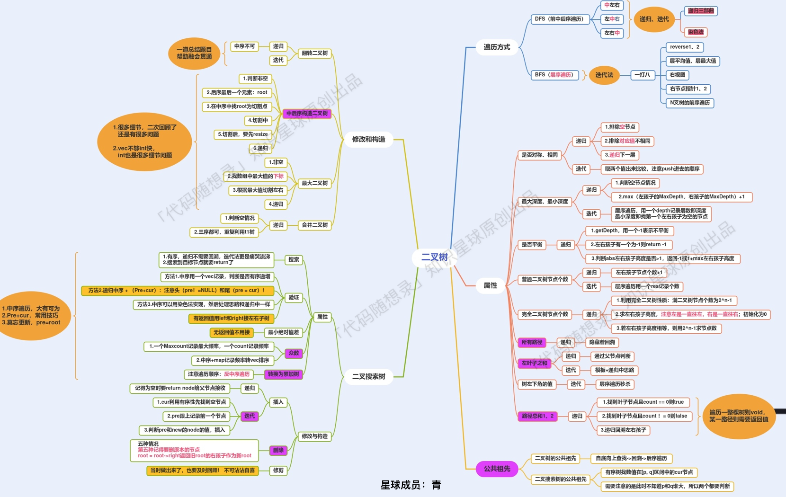

# 二叉树

### 基本概念

二叉树有两种主要的形式：**满二叉树**和**完全二叉树**。

#### 二叉树分类

##### 满二叉树

满二叉树：如果一棵二叉树只有度为0的结点和度为2的结点，并且度为0的结点在同一层上，则这棵二叉树为满二叉树。

这棵二叉树为满二叉树，也可以说深度为k，有2^k-1个节点的二叉树


##### 完全二叉树

完全二叉树的定义如下：在完全二叉树中，**除了最底层节点可能没填满外**，其余每层节点数都达到最大值，并且最下面一层的节点都集中在该层最左边的若干位置。若最底层为第 h 层（h从1开始），则该层包含 1~ 2^(h-1) 个节点。


##### 二叉搜索树(有数值的二叉树)

前面介绍的树，都没有数值的，而二叉搜索树是有数值的了，**二叉搜索树是一个有序树**。

- 若它的左子树不空，则左子树上所有结点的值均小于它的根结点的值；
- 若它的右子树不空，则右子树上所有结点的值均大于它的根结点的值；
- 它的左、右子树也分别为二叉排序树


##### 平衡二叉搜索树

平衡二叉搜索树：又被称为AVL（Adelson-Velsky and Landis）树，且具有以下性质：**它是一棵空树或它的左右两个子树的高度差的绝对值不超过1**，并且左右两个子树都是一棵平衡二叉树。


**C++中map、set、multimap，multiset的底层实现都是平衡二叉搜索树**，所以map、set的增删操作时间时间复杂度是logn

#### 二叉树的存储方式

**二叉树可以链式存储，也可以顺序存储。**

那么链式存储方式就用指针， 顺序存储的方式就是用数组。

##### 链式存储


##### 顺序存储


**如果父节点的数组下标是 i，那么它的左孩子就是 i \* 2 + 1，右孩子就是 i \* 2 + 2。**

#### 二叉树的遍历方式

二叉树主要有两种遍历方式：

1. 深度优先遍历(DFS)：先往深走，遇到叶子节点再往回走。
2. 广度优先遍历(BFS)：一层一层的去遍历。

- 深度优先遍历：**这里前中后，其实指的就是中间节点的遍历顺序**
  - 前序遍历（递归法，迭代法）
  - 中序遍历（递归法，迭代法）
  - 后序遍历（递归法，迭代法）
- 广度优先遍历
  - 层次遍历（迭代法）


#### 定义二叉树

```c++
struct TreeNode {
    int val;
    TreeNode *left;
    TreeNode *right;
    TreeNode(int x) : val(x), left(NULL), right(NULL) {}
};
```

#### 创建二叉树

```C++
#include <iostream>
#include <bits/stdc++.h>    //包含很多其他库，写算法题可以用。
using namespace std;

struct TreeNode
{
    int val;
    TreeNode *left;
    TreeNode *right;
    TreeNode(int x) : val(x), left(nullptr), right(nullptr) {}
};

class Soilution
{
public:
    void traversal(TreeNode *cur, vector<int> &vec)
    {
        if(cur == nullptr) return;  
        vec.push_back(cur->val);    // 中
        traversal(cur->left, vec);  // 左
        traversal(cur->right, vec); // 右
    }

    //前序遍历
    vector<int> preorderTraversal(TreeNode *root)
    {
        vector<int> ret;
        traversal(root, ret);

        return ret;
    }
};

//迭代法前序创建二叉树
TreeNode* createTree(vector<char>& nodes)
{
    if(nodes.empty() || nodes[0] == '#') return nullptr;

    TreeNode* root = new TreeNode(nodes[0] - '0');
    queue<TreeNode*> que;
    que.push(root);

    int i = 1;
    while(!que.empty() && i < nodes.size())
    {
        TreeNode* cur = que.front();
        que.pop();

        if(nodes[i] != '#')
        {
            cur->left = new TreeNode(nodes[i] - '0');
            que.push(cur->left);
        }
        i++;

        if(i < nodes.size() && nodes[i] != '#')
        {
            cur->right = new TreeNode(nodes[i] - '0');
            que.push(cur->right);
        }
        i++;
    }

    return root;
}

int main(int argc, char **argv)
{
    vector<char> test;
    char ch;
    while(cin >> ch)
    {
        if(ch == 'q') break;;
        test.push_back(ch);
    }
    TreeNode *root = createTree(test);
    Soilution *so = new Soilution();
    vector<int> ret = so->preorderTraversal(root);
    for(auto i : ret)
    {
        cout << i << " ";
    }

    return 0;
}
```

### 相关算法

- 二叉树递归遍历
- 二叉树的迭代遍历
- 二叉树的统一迭代法
- 二叉树的层序遍历
- 翻转二叉树
- 对称二叉树
- 二叉树的最大深度
- 二叉树的最小深度
- 完全二叉树的节点个数

#### 二叉树递归遍历

- 深度优先遍历(DFS):前、中、后序遍历都是相对于中间节点而言。
- 递归结束条件：cur == nullptr
- 递归函数参数和返回值

```c++
//前序遍历
class Solution {
public:
    void traversal(TreeNode* cur, vector<int>& vec) {
        if (cur == nullptr)
            return;
        vec.push_back(cur->val);
        traversal(cur->left, vec);
        traversal(cur->right, vec);
    }

    vector<int> preorderTraversal(TreeNode* root) {
        vector<int> ret;
        traversal(root, ret);

        return ret;
    }
};
```

```c++
//中序遍历
class Solution {
public:
    void traversal(TreeNode* cur, vector<int>& vec) {
        if (cur == nullptr)
            return;
        traversal(cur->left, vec);
        vec.push_back(cur->val);
        traversal(cur->right, vec);
    }

    vector<int> inorderTraversal(TreeNode* root) {
        vector<int> ret;
        traversal(root, ret);

        return ret;
    }
};
```

```c++
//后序遍历
class Solution {
public:
    void traversal(TreeNode* cur, vector<int>& vec) {
        if (cur == nullptr)
            return;

        traversal(cur->left, vec);
        traversal(cur->right, vec);
        vec.push_back(cur->val);
    }

    vector<int> postorderTraversal(TreeNode* root) {
        vector<int> ret;
        traversal(root, ret);

        return ret;
    }
};
```

#### 二叉树的迭代法遍历

- 前序遍历的迭代法比较简单
- 因为要访问的元素和要处理的元素顺序是一致的，都是中间节点。

```c++
//前序遍历
class Solution {
public:
    vector<int> preorderTraversal(TreeNode* root) {
        stack<TreeNode*> st;
        vector<int> ret;
        if(root == nullptr) return ret;	//空节点不入栈
        st.push(root);

        while(!st.empty())
        {
          TreeNode* cur = st.top();
          st.pop();
          ret.push_back(cur->val);

          if(cur->right) st.push(cur->right);	//右节点先进栈，这样出栈顺序才是正确的。
          if(cur->left) st.push(cur->left);
        }

        return ret;
    }
};
```

- 中序遍历：先找到左下角节点，再从后往前遍历。
- 使用栈存储节点

```c++
class Solution {
public:
    vector<int> inorderTraversal(TreeNode* root) {
        stack<TreeNode*> st;
        vector<int> ret;
        TreeNode* cur = root;
        while(cur != nullptr || !st.empty())	//使用或判断，因为cur可能为nullptr但是st里面还有节点(往回走)
        {
            if(cur != nullptr)
            {
                st.push(cur);
                cur = cur->left;    //左
            }
            else
            {
                cur = st.top();
                st.pop();
                ret.push_back(cur->val); //中
                cur = cur->right;   //右
            }
        }

        return ret;
    }
};
```

- 后序遍历：**中左右**是前序遍历(最简单),后序遍历是**左右中**。
- 前序遍历修改遍历左右节点的顺序(很容易实现)-->中右左
- 翻转中右左遍历的结果就是后序遍历的结果

```c++
class Solution {
public:
    vector<int> postorderTraversal(TreeNode* root) {
        vector<int> ret;
        stack<TreeNode*> st;
        if(root == nullptr) return ret;
        st.push(root);
        
        while(!st.empty())
        {
            TreeNode *cur = st.top();
            ret.push_back(cur->val);
            st.pop();
            
            if(cur->left) st.push(cur->left);	//修改左右节点遍历顺序
            if(cur->right) st.push(cur->right);
        }

        reverse(ret.begin(), ret.end());	//翻转结果

        return ret;
    }
};
```

#### 二叉树的统一迭代法

- 标记未处理的中间节点：在压入中间节点后再压入nullptr，表示该节点已经访问过了但是没有处理

```c++
class Solution {
public:
    vector<int> inorderTraversal(TreeNode* root) {
        vector<int> ret;
        stack<TreeNode*> st;
        if(root != nullptr) st.push(root);

        while(!st.empty())
        {
            TreeNode *node = st.top();  //每次都是从左节点进入下一层
            if(node)
            {
                st.pop();
                if(node->right) st.push(node->right);   //加入右节点

                st.push(node);  //加入中间节点
                st.push(nullptr);   //标记中间节点访问过，但是没有处理

                if(node->left) st.push(node->left); //最后加入左节点
            }
            else
            {
                st.pop();   //弹出空节点
                node = st.top();
                st.pop();

                ret.push_back(node->val);
            }
        }

        return ret;
    }
};
```

#### 二叉树层序遍历

- 使用队列存储节点的访问顺序
- 每次循环后queue的size就是下一层元素的数量，并且顺序都是正确的。
- 每次for循环都是遍历当前层的元素，基于这个特点有很多变形的题目。

```c++
class Solution {
public:
    vector<vector<int>> levelOrder(TreeNode* root) {
        vector<vector<int>> ret;
        queue<TreeNode*> que;
        if(root != nullptr) que.push(root);
        while(!que.empty())
        {
            int size = que.size();
            vector<int> vec;
            for(int i = 0; i < size; i++)
            {
                TreeNode *node = que.front();
                que.pop();
                vec.push_back(node->val);
                if(node->left) que.push(node->left);
                if(node->right) que.push(node->right);
            }

            ret.push_back(vec);
        }

        return ret;
    }
};
```

#### 翻转二叉树

##### 递归法

- 实现过程简单：前序遍历的过程中交换左右节点
- 递归法的中序遍历可能会翻转两次左右节点，所以需要按照左中左的方式遍历

```c++
class Solution {
public:
    TreeNode* invertTree(TreeNode* root) {
        if(root == nullptr) return root;

        swap(root->left, root->right);
        invertTree(root->left);
        invertTree(root->right);

        return root;
    }
};
```

##### 迭代法

- 实现过程：在前序遍历的过程中交换左右节点

```c++
class Solution {
public:
    TreeNode* invertTree(TreeNode* root) {
        if(root == nullptr) return root;

        stack<TreeNode*> st;
        st.push(root);
        while(!st.empty())
        {
            TreeNode *node = st.top();
            st.pop();
            swap(node->left, node->right);
            if(node->right) st.push(node->right);
            if(node->left) st.push(node->left);
        }

        return root;
    }
};
```

##### 统一的迭代法

- 对中间节点进行交换左右孩子节点

```c++
class Solution {
public:
    TreeNode* invertTree(TreeNode* root) {
        stack<TreeNode*> st;
        if(root == nullptr) return root;
        st.push(root);

        while(!st.empty())
        {
            TreeNode *node = st.top();
            st.pop();
            if(node != nullptr)
            {
                if(node->right) st.push(node->right);
                if(node->left) st.push(node->left);
                st.push(node);
                st.push(nullptr);
            }
            else
            {
                node = st.top();
                swap(node->left, node->right);
                st.pop();
            }
        }

        return root;
    }
};
```

#### 对称二叉树

##### 递归法

- 递归比较左右子树的内外两侧节点是否相等

```c++
class Solution {
public:
    bool compare(TreeNode *left, TreeNode *right)
    {
        if(left == NULL && right != NULL) return false;
        else if(left != NULL && right == NULL) return false;
        else if(left == NULL && right == NULL) return true;
        else if(left->val != right->val) return false;

        // 此时就是：左右节点都不为空，且数值相同的情况
        // 开始递归，做下一层的判断
        bool outside = compare(left->left, right->right);
        bool inside = compare(left->right, right->left);
        return outside && inside;
    }

    bool isSymmetric(TreeNode* root) 
    {
        if(root == NULL) return true;
        
        return compare(root->left, root->right);
    }
};
```

##### 迭代法队列实现

- 使用队列成对加入元素，成对取出元素进行比较
- 从外向内进行比较
- 队列换成栈也是没问题的

```c++
class Solution {
public:
    bool isSymmetric(TreeNode* root) {
        queue<TreeNode*> que;
        if(root != nullptr)
        {
            que.push(root->left);
            que.push(root->right);
        }

        while(!que.empty() && !que.empty())
        {
            TreeNode *left = que.front();
            que.pop();
            TreeNode *right = que.front();
            que.pop();

            if(!left && !right) continue;

            if((!left || !right || (left->val != right->val))) return false;

            //外侧
            que.push(left->left);
            que.push(right->right);

            //内侧
            que.push(left->right);
            que.push(right->left);
        }

        return true;
    }
};
```

#### 二叉树的最大深度

- 二叉树节点的深度：指从**根节点**到该节点的最长简单路径边的条数或者节点数（取决于深度从0开始还是从1开始）,一定是从根节点开始。
- 二叉树节点的高度：指从**该节点**到叶子节点的最长简单路径边的条数或者节点数（取决于高度从0开始还是从1开始）,从该节点开始。

##### 递归法

- 加1：因为当前时中间节点，如果是最后一个节点需要加上这个中间节点
- 递归结束条件：当前节点为空
- 使用后序遍历不需要回溯

```c++
//后序遍历
class Solution {
public:
    int maxDepth(TreeNode* root) {
        if(root == nullptr) return 0;

        return 1 + max(maxDepth(root->left), maxDepth(root->right)); 
    }
};
```

##### 回溯法

- 回溯法使用前序遍历

```c++
class Solution {
public:
    int ret = 0;

    void getdepth(TreeNode* root, int depth)
    {
        ret = depth > ret ? depth : ret;    //中
        if(root->left == nullptr && root->right == nullptr) return;

        if(root->left)  //左
        {
            depth++;
            getdepth(root->left, depth);
            depth--; //回溯
        }

        if(root->right) //右
        {
            depth++;
            getdepth(root->right, depth);
            depth--;
        }

        return;
    }

    int maxDepth(TreeNode* root) {
        if(root == nullptr) return ret;

        getdepth(root, 1);

        return ret;
    }
};
```

##### 迭代法

```c++
class Solution {
public:
    int maxDepth(TreeNode* root) {
        queue<TreeNode*> que;
        if(root != nullptr) que.push(root);
        int depth = 0;
        while(!que.empty())
        {
            int size = que.size();
            for(int i = 0; i < size; i++)
            {
                TreeNode *node = que.front();
                que.pop();
                if(node->left) que.push(node->left);
                if(node->right) que.push(node->right);
            }
            depth++;
        }
        return depth;
    }
};
```

#### 二叉树的最小深度

- 迭代法容易理解

##### 迭代法

- BFS遍历遇到节点没有左右节点就返回即可

```c++
class Solution {
public:
    int minDepth(TreeNode* root) {
        queue<TreeNode*> que;
        if(root != nullptr) que.push(root);
        int depth = 0;
        while(!que.empty())
        {
            int size = que.size();
            for(int i = 0; i < size; i++)
            {
                TreeNode *node = que.front();
                que.pop();
                if(node->left) que.push(node->left);
                if(node->right) que.push(node->right);
                if(!node->left && !node->right) return ++depth;
            }

            depth++;
        }

        return depth;
    }
};
```

##### 递归法

```c++
//未精简
class Solution {
public:
    int getDepth(TreeNode* node) {
        if (node == NULL) return 0;
        int leftDepth = getDepth(node->left);           // 左
        int rightDepth = getDepth(node->right);         // 右
                                                        // 中
        // 当一个左子树为空，右不为空，这时并不是最低点
        if (node->left == NULL && node->right != NULL) { 
            return 1 + rightDepth;
        }   
        // 当一个右子树为空，左不为空，这时并不是最低点
        if (node->left != NULL && node->right == NULL) { 
            return 1 + leftDepth;
        }
        int result = 1 + min(leftDepth, rightDepth);
        return result;
    }

    int minDepth(TreeNode* root) {
        return getDepth(root);
    }
};
```

```c++
class Solution {
public:
    int minDepth(TreeNode* root) {
        if(root == nullptr) return 0;

        if(root->left == nullptr && root->right != nullptr)
        {
            return 1 + minDepth(root->right);
        }

        if(root->right == nullptr && root->left != nullptr)
        {
            return 1 + minDepth(root->left);
        }
		
        //如果左右子节点都不为空继续递归左右子树
        return 1 + min(minDepth(root->left), minDepth(root->right));
    }
};
```

#### 完全二叉树节点个数

##### 递归法

- 递归结束条件：root == nullptr
- 返回值：1(中间节点) + 左子树节点个数 + 右子树节点个数

```c++
class Solution {
public:
    int countNodes(TreeNode* root) {
        if(root == nullptr) return 0;

        return 1 + countNodes(root->left) + countNodes(root->right);
    }
};
```

##### 迭代法

- 累加每层节点数量

```c++
class Solution {
public:
    int countNodes(TreeNode* root) {
        queue<TreeNode*> que;
        if(root != nullptr) que.push(root);
        int ret = 0;
        while(!que.empty())
        {
            int size = que.size();
            ret += size;

            for(int i = 0; i < size; i++)
            {
                TreeNode* node = que.front();
                que.pop();
                if(node->left) que.push(node->left);
                if(node->right) que.push(node->right);
            }
        }

        return ret;
    }
};
```

#### 平衡二叉树

##### 高度与深度再巩固


##### 递归法

- 递归函数的参数和返回值：参数是当前传入节点、返回值是以当前传入节点为根节点的树的高度或者-1
- 递归函数的终止条件：当前传入节点为空
- 递归单层调用逻辑：分别求出其左右子树的高度，然后如果差值小于等于1，则返回当前二叉树的高度，否则返回-1，表示已经不是二叉平衡树了。

```c++
class Solution {
public:
    int getHeigth(TreeNode* root)
    {
        if(root == nullptr) return 0;
        int leftH = getHeigth(root->left);
        int rightH = getHeigth(root->right);

        if(leftH == -1) return -1;
        if(rightH == -1) return -1;

        return abs(leftH - rightH) > 1 ? -1 : 1 + max(leftH, rightH);	//取最大值为高度
    }

    bool isBalanced(TreeNode* root) {
        if(getHeigth(root) == -1)
        return false;
        return true;
    }
};
```

#### 二叉树的所有路径

##### 回溯法

- 根节点到叶子节点：前序遍历
- 递归(回溯)函数的参数和返回值：void traversal(TreeNode* cur, vector<int>& path, vector<string>& ret)
- 终止条件：找到叶子节点：if(cur->right == nullptr && cur->left == nullptr)
- 单层调用逻辑：当前节点存在左或右子节点时以左或右节点为根节点递归，并且回溯一次。

```c++
class Solution {
public:
    void traversal(TreeNode* cur, vector<int>& path, vector<string>& ret)
    {
        path.push_back(cur->val);
        if(cur->right == nullptr && cur->left == nullptr)
        {
            string spath;
            for(int i = 0; i < path.size() - 1; i++)
            {
                spath += to_string(path[i]);
                spath += "->";
            }

            spath += to_string(path[path.size() - 1]);
            ret.push_back(spath);
            return;
        }

        if(cur->left)
        {
            traversal(cur->left, path, ret);
            path.pop_back();
        }

        if(cur->right)
        {
            traversal(cur->right, path, ret);
            path.pop_back();
        }
    }

    vector<string> binaryTreePaths(TreeNode* root) {
        vector<int> path;
        vector<string> ret;
        if(root == nullptr) return ret;
        traversal(root, path, ret);

        return ret;
    }
};
```

简化版本

```c++
class Solution {
public:
    void traversal(TreeNode* cur, string path, vector<string>& ret)
    {
        path += to_string(cur->val);
        if(cur->left == nullptr && cur->right == nullptr)
        {
            ret.push_back(path);
            return;
        }

        //path + "->" 作为参数传入，没有改变path的值，相当于执行函数后自动回溯了
        //path1(函数执行的path) = path + "->";
        if(cur->left) traversal(cur->left, path + "->", ret);   //左
        if(cur->right) traversal(cur->right, path + "->", ret); //右
    }

    vector<string> binaryTreePaths(TreeNode* root) {
        string path;
        vector<string> ret;
        if(root == nullptr) return ret;

        traversal(root, path, ret);

        return ret;
    }
};
```

#### 左叶子之和

- 不能通过当前节点判断该节点是否是左叶子节点，需要通过父节点判断是否存在左叶子。所有递归要使用后序遍历。
- 当遇到左叶子节点的时候，记录数值，然后通过递归求取左子树左叶子之和，和 右子树左叶子之和，相加便是整个树的左叶子之和。

##### 递归法

```c++
class Solution {
public:
    int sumOfLeftLeaves(TreeNode* root) {
        if(root == nullptr) return 0;
        else if(!root->left && !root->right) return 0;

        int leftValue = sumOfLeftLeaves(root->left);
        if(root->left && !root->left->left && !root->left->right)
        {
            leftValue = root->left->val;
        }
        int rightValue = sumOfLeftLeaves(root->right);

        return rightValue + leftValue;
    }
};
```

##### 迭代法

```c++
class Solution {
public:
    int sumOfLeftLeaves(TreeNode* root) {
        int ret = 0;
        queue<TreeNode*> que;
        if(root == nullptr || (root->left == nullptr && root->right == nullptr)) return 0;
        que.push(root);

        while(!que.empty())
        {
            int size = que.size();

            for(int i = 0; i < size; i++)
            {
                TreeNode *node = que.front();
                que.pop();

                if(node->left) 
                {
                    que.push(node->left);
                    if(node->left->left == nullptr && node->left->right == nullptr)
                    ret += node->left->val;
                }
                if(node->right) que.push(node->right);


            }
        }

        return ret;
    }
};

```

#### 找树左下角的值

##### 层序遍历法

- 返回最后一层第一个元素即可

```c++
class Solution {
public:
    int findBottomLeftValue(TreeNode* root) {
        int ret = 0;
        queue<TreeNode*> que;
        if(root) que.push(root);

        while(!que.empty())
        {
            int size = que.size();

            for(int i = 0; i < size; i++)
            {
                TreeNode *node = que.front();
                que.pop();

                if(i == 0) ret = node->val;
                if(node->left) que.push(node->left);
                if(node->right) que.push(node->right);
            }
        }

        return ret;
    }
};
```

##### 递归法

- 记录当前节点深度，如果大于最大深度，更新ret的值
- 使用前序遍历(或中序遍历)确保左节点优先遍历

```c++
class Solution {
public:
    int maxDepth = INT_MIN;
    int ret;

    void traversal(TreeNode *root, int depath)
    {
        if(!root->left && !root->right)
        {
            if(depath > maxDepth)
            {
                maxDepth = depath;
                ret = root->val;
            }
            return;
        }

        if(root->left) traversal(root->left, depath + 1);
        if(root->right) traversal(root->right, depath + 1);

        return;

    }

    int findBottomLeftValue(TreeNode* root) {
        traversal(root, 0);

        return ret;
    }
};
```

#### 路径总和

##### 递归法

```c++
class Solution {
public:
    bool traversal(TreeNode* root, int targetSum)
    {
        if(!root->left && !root->right && targetSum == 0) return true;
        if(!root->left && !root->right) return false;

        if(root->left)
        {
            if(traversal(root->left, targetSum - root->left->val))
            return true;
        }
        if(root->right) 
        {
            if(traversal(root->right, targetSum - root->right->val))
            return true;
        }

        return false;
    }
        
    bool hasPathSum(TreeNode* root, int targetSum) {
        if(!root) return false;
        return traversal(root, targetSum - root->val);
    }
};
```

```c++
class Solution {
public:
    bool hasPathSum(TreeNode* root, int targetSum) {
        if(!root) return false;
        if(!root->left && !root->right && targetSum == root->val) return true;

        return hasPathSum(root->left, targetSum - root->val) 
            || hasPathSum(root->right, targetSum - root->val);
    } 
};
```

##### 迭代法

```c++
class Solution {
public:
    bool hasPathSum(TreeNode* root, int targetSum) {
        stack<pair<TreeNode*, int>> st;
        if(root) st.push(pair<TreeNode*, int>(root, root->val));

        while(!st.empty())
        {
            pair<TreeNode*, int> node = st.top();
            st.pop();
            if(!node.first->left && !node.first->right && targetSum == node.second)
            return true;

            if(node.first->right)
            {
                st.push(pair<TreeNode*, int>(node.first->right, node.second + node.first->right->val));
            }

            if (node.first->left) 
            {
                st.push(pair<TreeNode*, int>(node.first->left, node.second + node.first->left->val));
            }
        }

        return false;
    }
};
```

#### 从中序与后序遍历序列构造二叉树

##### 如何根据两个顺序构造一个唯一的二叉树

- 通过后序、前序遍历确定根节点
- 通过根节点在中序遍历中划分左右子树
- 根据中序遍历划分的结果在前、后序遍历中划分左右子树找到左右子树的根节点
- 从上面操作，知道无法再划分左右节点


> **前序和后序不能唯一确定一棵二叉树！**，因为没有中序遍历无法确定左右部分，也就是无法分割。

##### 递归法

```c++
class Solution {
public:
    TreeNode* traversal(vector<int>& inorder, vector<int>& postorder) {
        //1.非空判断
        if(postorder.size() == 0) return nullptr;

        //2.找到后序遍历的最后一个元素----根节点
        int rootval = postorder[postorder.size() -1];
        TreeNode *root = new TreeNode(rootval);

        if(postorder.size() == 1) return root;

        //3.在后序遍历中切割左右子树
        //3.1找到切割点
        int index = 0;
        for(index = 0; index < inorder.size(); index++)
        {
            if(inorder[index] == rootval) break;
        }

        //3.2 切割中序遍历
        //左开右闭
        vector<int> leftInorder(inorder.begin(), inorder.begin() + index);
        vector<int> rightInorder(inorder.begin() + index + 1, inorder.end());

        //4. 切割后序数组, 后序数组没有明确的左右子树。按leftInorder、rightInorder大小切割。
        postorder.resize(postorder.size() - 1);
        vector<int> leftPostorder(postorder.begin(), postorder.begin() + leftInorder.size());
        vector<int> rightPostorder( postorder.begin() + leftInorder.size(), postorder.end());

        //5.递归处理
        root->left = traversal(leftInorder, leftPostorder);
        root->right = traversal(rightInorder, rightPostorder);

        return root;
    }

    TreeNode* buildTree(vector<int>& inorder, vector<int>& postorder) {
        if(inorder.size() == 0 || postorder.size() == 0) return nullptr;

        return traversal(inorder, postorder);
    }

    vector<vector<int>> levelOrder(TreeNode* root) {
        queue<TreeNode*> que;
        if(root != nullptr) que.push(root);
        vector<vector<int>> ret;

        while(!que.empty())
        {
            int size = que.size();  //记录size,后面会变化
            vector<int> vec;
            for(int i = 0; i < size; i++)
            {
                TreeNode *node = que.front();
                que.pop();
                vec.push_back(node->val);
                if(node->left) que.push(node->left);
                if(node->right) que.push(node->right);
            }

            ret.push_back(vec);;
        }

        return ret;
    }
};
```

#### 最大二叉树

- 前序遍历
- 划分左右子树
- 递归构建二叉树

```c++
class Solution {
public:
    TreeNode* constructMaximumBinaryTree(vector<int>& nums) {
        if(nums.size() == 1)
        {
            TreeNode *root = new TreeNode(nums[0]);
            return root;
        }

        int max = 0;
        int index = 0;
        for(int i = 0; i < nums.size(); i++)
        {
            if(nums[i] > max)
            {
                max = nums[i];
                index = i;
            }
        }

        TreeNode *root = new TreeNode(nums[index]);
        if(index > 0)
        {
            vector<int> leftT(nums.begin(), nums.begin() + index);
            root->left = constructMaximumBinaryTree(leftT);
        }

        if(index < nums.size() - 1)
        {
            vector<int> rightT(nums.begin() + index + 1, nums.end());
            root->right = constructMaximumBinaryTree(rightT);
        }

        return root;
    }
};
```

#### 合并二叉树

##### 递归法

- 前中后序遍历都可以

```c++
class Solution {
public:
    TreeNode* mergeTrees(TreeNode* root1, TreeNode* root2) {
        if(root1 == nullptr) return root2;
        if(root2 == nullptr) return root1;

        root1->val += root2->val;
        root1->left = mergeTrees(root1->left, root2->left);
        root1->right = mergeTrees(root1->right, root2->right);

        return root1;
    }
};
```


#### 二叉搜索树中的搜索

##### 二叉搜索树

二叉搜索树是一个有序树：

- 若它的左子树不空，则左子树上所有结点的值均小于它的根结点的值；
- 若它的右子树不空，则右子树上所有结点的值均大于它的根结点的值；
- 它的左、右子树也分别为二叉搜索树

##### 迭代法

```c++
class Solution {
public:
    TreeNode* searchBST(TreeNode* root, int val) {
        while(root)
        {
            if(root->val > val) root = root->left;
            else if(root->val < val) root = root->right;
            else return root;
        }

        return nullptr;
    }
};
```

##### 递归法

```c++
class Solution {
public:
    TreeNode* searchBST(TreeNode* root, int val) {
        if(root == nullptr || root->val == val) return root;

        if(root->val > val) return searchBST(root->left, val);
        if(root->val < val) return searchBST(root->right, val);
        return nullptr;
    }
};
```

#### 验证二叉搜索树

##### 中序遍历+判断结果是否递增

- 中序遍历的结果存储在一个容器中，遍历容器判断是否是递增的

```C++
class Solution {
public:
    vector<int> vec;

    void traversal(TreeNode* root)
    {
        if(root == nullptr) return;

        if(root->left) traversal(root->left);
        vec.push_back(root->val);
        if(root->right) traversal(root->right);
    }

    bool isValidBST(TreeNode* root) {
        traversal(root);
        for(int i = 1; i < vec.size(); i++)
        {
            if(vec[i - 1] >= vec[i])
                return false;
        }

        return true;
    }
};
```

##### 中序遍历

- 使用一个全局变量maxVal记录中序遍历中的"中"(root->val)
- 递归更新maxVal，确保maxVal是递增的，否则返回false
- root == nullptr 也是二叉搜索树

```c++
class Solution {
public:
    long long maxVal = LONG_MIN;

    //中序遍历一直更新maxVal，确保maxval是一直递增的
    bool isValidBST(TreeNode* root) {
       if(root == nullptr) return true;

       bool left = isValidBST(root->left);  //左
       
       if(root->val > maxVal) maxVal = root->val;   //中
       else return false;

       bool right = isValidBST(root->right);    //右

       return left && right;
    }
};
```

##### 迭代法

```c++
class Solution {
public:
    bool isValidBST(TreeNode* root) {
       stack<TreeNode*> st;
       TreeNode* pre = nullptr;
       TreeNode* cur = root;

       while(cur != nullptr || !st.empty())
       {
            if(cur != nullptr)
            {
                st.push(cur);
                cur = cur->left;
            }
            else
            {
                cur = st.top();
                st.pop();

                if(pre != nullptr && pre->val >= cur->val)
                    return false;
                else pre = cur;

                cur = cur->right;
            }
       }

       return true;
    } 
};
```

#### 二叉搜索树的最小绝对差

- 中序遍历二叉搜索树结果是一个连续递增的序列

##### 递归法

```c++
class Solution {
public:
    int ret = INT_MAX;
    TreeNode *pre = nullptr;
    void traversal(TreeNode* root)
    {
        if(root == nullptr) return;

        traversal(root->left);
        if(pre != nullptr)
        {
            ret = min(ret, root->val - pre->val);
        }

        pre = root;

        traversal(root->right);
    }

    int getMinimumDifference(TreeNode* root) {
        traversal(root);

        return ret;
    }
};
```

##### 迭代法

```c++
class Solution {
public:
    int getMinimumDifference(TreeNode* root) {
        int ret = INT_MAX;
        stack<TreeNode*> st;
        TreeNode* cur = root;
        TreeNode* pre = nullptr;

        while(cur != nullptr || !st.empty())
        {
            if(cur != nullptr)
            {
                st.push(cur);
                cur = cur->left;
            }
            else
            {
                cur = st.top();
                st.pop();

                if(pre != nullptr)
                {
                    ret = min(ret, cur->val - pre->val);
                }
                pre = cur;

                cur = cur->right;
            }
        }
        return ret;
    }
};
```

#### 二叉搜索树的众数

- 简单题，利用二叉搜索树的特点模拟解题即可

##### 递归法

```c++
class Solution {
private:
    vector<int> ret;
    int count = 1;
    int maxCount = 1;
    TreeNode* pre = nullptr;

    void traversal(TreeNode* root)
    {
        if(root == nullptr) return;

        traversal(root->left);
        if(pre != nullptr && pre->val == root->val)
        {
            count++;
        }
        else count = 1;
        pre = root;

        if(count == maxCount) ret.push_back(root->val);
        if(count > maxCount)
        {
            ret.clear();
            maxCount = count;
            ret.push_back(root->val);
        }

        traversal(root->right);
    }
public:
    vector<int> findMode(TreeNode* root) {
        traversal(root);
        return ret;
    }
};
```

#### 迭代法

```c++
class Solution {
public:
    vector<int> findMode(TreeNode* root) {
        stack<TreeNode*> st;
        TreeNode* cur = root;
        TreeNode* pre = NULL;
        int maxCount = 0; // 最大频率
        int count = 0; // 统计频率
        vector<int> result;
        while (cur != NULL || !st.empty()) {
            if (cur != NULL) { // 指针来访问节点，访问到最底层
                st.push(cur); // 将访问的节点放进栈
                cur = cur->left;                // 左
            } else {
                cur = st.top();
                st.pop();                       // 中
                if (pre == NULL) { // 第一个节点
                    count = 1;
                } else if (pre->val == cur->val) { // 与前一个节点数值相同
                    count++;
                } else { // 与前一个节点数值不同
                    count = 1;
                }
                if (count == maxCount) { // 如果和最大值相同，放进result中
                    result.push_back(cur->val);
                }

                if (count > maxCount) { // 如果计数大于最大值频率
                    maxCount = count;   // 更新最大频率
                    result.clear();     // 很关键的一步，不要忘记清空result，之前result里的元素都失效了
                    result.push_back(cur->val);
                }
                pre = cur;
                cur = cur->right;               // 右
            }
        }
        return result;
    }
};
```

#### 二叉树的最近公共祖先

给定一个二叉树, 找到该树中两个指定节点的最近公共祖先。

百度百科中最近公共祖先的定义为：“对于有根树 T 的两个结点 p、q，最近公共祖先表示为一个结点 x，满足 x 是 p、q 的祖先且 x 的深度尽可能大（一个节点也可以是它自己的祖先）

- 回溯法
- 从下往上回溯

```c++
class Solution {
public:
    TreeNode* lowestCommonAncestor(TreeNode* root, TreeNode* p, TreeNode* q) {
        //1.终止条件
        if(root == p || root == q || root == nullptr) return root;
        
        //2.递归逻辑
        TreeNode *left = lowestCommonAncestor(root->left, p, q);
        TreeNode *right = lowestCommonAncestor(root->right, p, q);

        //3.返回值
        if(left != nullptr && right != nullptr) return root;
        
        if(left != nullptr && right == nullptr) return left;
        else if(left == nullptr && right != nullptr) return right;
        else return nullptr;
    }
};
```

#### 二叉搜索树的最近公共祖先

结论：从根节点搜索，第一次遇到 cur节点是数值在[q, p]区间中则该节点是二叉搜索树的最近公共祖先


```c++
//精简后的代码
class Solution {
public:
    TreeNode* lowestCommonAncestor(TreeNode* root, TreeNode* p, TreeNode* q) {
        if(root->val > p->val && root->val > q->val) return lowestCommonAncestor(root->left, p, q);
        else if(root->val < p->val && root->val < q->val) return lowestCommonAncestor(root->right, p, q);
        else return root;
    }
};
```

```c++
class Solution {
private:
    TreeNode* traversal(TreeNode* cur, TreeNode* p, TreeNode* q) {
        if (cur == NULL) return cur;
                                                        // 中
        if (cur->val > p->val && cur->val > q->val) {   // 左
            TreeNode* left = traversal(cur->left, p, q);
            if (left != NULL) {
                return left;
            }
        }

        if (cur->val < p->val && cur->val < q->val) {   // 右
            TreeNode* right = traversal(cur->right, p, q);
            if (right != NULL) {
                return right;
            }
        }
        return cur;
    }
public:
    TreeNode* lowestCommonAncestor(TreeNode* root, TreeNode* p, TreeNode* q) {
        return traversal(root, p, q);
    }
};
```

##### 迭代法

```c++
class Solution {
public:
    TreeNode* lowestCommonAncestor(TreeNode* root, TreeNode* p, TreeNode* q) {
        while(root)
        {
            if(root->val > p->val && root->val > q->val) root = root->left;
            else if(root->val < p->val && root->val < q->val) root = root->right;
            else return root;
        }

        return NULL;
    }
};
```

#### 二叉搜索树中的插入操作

##### 递归法

- 不改变原来结构，在叶子节点后添加。递归找到符合要求的空节点即可。
- 不需要遍历整颗树，只需要遍历某条边即可。

```c++
class Solution {
public:
    TreeNode* insertIntoBST(TreeNode* root, int val) {
        //1.终止条件
        if(root == nullptr)
        {
            TreeNode *node = new TreeNode(val);
            return node;
        }

        //2.递归逻辑,只需遍历一条边即可
        if(root->val > val) root->left =  insertIntoBST(root->left, val);
        if(root->val < val) root->right = insertIntoBST(root->right, val);

        return root;
    }
};
```

##### 迭代法

- 迭代法需要额外使用空间记录前一个节点。

```c++
TreeNode* insertIntoBST(TreeNode* root, int val) {
        if(root == nullptr)
        {
            TreeNode *node = new TreeNode(val);
            return node;
        }

        TreeNode *cur = root;
        TreeNode *pre = root;
        while(cur != nullptr)
        {
            pre = cur;
            if(cur->val > val) cur = cur->left;
            else cur = cur->right;
        }

        TreeNode *node = new TreeNode(val);
        if(pre->val > val) pre->left = node;
        else pre->right = node;

        return root;
    }
```

#### 删除二叉搜索树中的节点

有以下五种情况：

- 第一种情况：没找到删除的节点，遍历到空节点直接返回了
- 找到删除的节点
  - 第二种情况：左右孩子都为空（叶子节点），直接删除节点， 返回NULL为根节点
  - 第三种情况：删除节点的左孩子为空，右孩子不为空，删除节点，右孩子补位，返回右孩子为根节点
  - 第四种情况：删除节点的右孩子为空，左孩子不为空，删除节点，左孩子补位，返回左孩子为根节点
  - 第五种情况：左右孩子节点都不为空，则将删除节点的左子树头结点（左孩子）放到删除节点的右子树的最左面节点的左孩子上，返回删除节点右孩子为新的根节点。


##### 递归法

```
class Solution {
public:
    TreeNode* deleteNode(TreeNode* root, int key) {
        //1.终止条件
        if(root == nullptr) return root;    //情况1：没有找到要删除的节点

        //2.递归逻辑
        if(root->val > key) root->left = deleteNode(root->left, key);
        if(root->val < key) root->right = deleteNode(root->right, key);

        //2.1 删除操作
        if(root->val == key)
        {   
            //情况2：左右节点都为空
            if(root->left ==nullptr && root->right == nullptr)
            {
                delete root;
                return nullptr;
            }
            else if(root->left == nullptr)  //情况3：左节点空，右节点不为空
            {
                TreeNode *retNode = root->right;
                delete root;
                return retNode;
            }
            else if(root->right == nullptr) //情况4：右节点空，左节点不为空
            {
                TreeNode *retNode = root->left;
                delete root;
                return retNode;
            }
            else    //情况5：左右节点不为空
            {
                TreeNode *cur = root->right;
                while (cur->left != nullptr)
                {
                    cur = cur->left;
                }

                cur->left = root->left;
                TreeNode *temp = root;
                root = root->right;
                delete temp;

                return root;
            }
        } 

        return root;
    }
};
```

##### 普通二叉树的删除方式

通用的删除，普通二叉树的删除方式（没有使用搜索树的特性，遍历整棵树），用交换值的操作来删除目标节点。

代码中目标节点（要删除的节点）被操作了两次：

- 第一次是和目标节点的右子树最左面节点交换。
- 第二次直接被NULL覆盖了。

```c++
class Solution {
public:
    TreeNode* deleteNode(TreeNode* root, int key) {
        if (root == nullptr) return root;
        if (root->val == key) {
            if (root->right == nullptr) { // 这里第二次操作目标值：最终删除的作用
                return root->left;
            }
            TreeNode *cur = root->right;
            while (cur->left) {
                cur = cur->left;
            }
            swap(root->val, cur->val); // 这里第一次操作目标值：交换目标值其右子树最左面节点。
        }
        root->left = deleteNode(root->left, key);
        root->right = deleteNode(root->right, key);
        return root;
    }
};
```

#### 修剪二叉搜索树

##### 递归法

- 递归(回溯)
- 跳过不在区间内的节点

```c++
class Solution {
public:
    TreeNode* trimBST(TreeNode* root, int low, int high) {
        //1.终止条件
        if(root == nullptr) return root;

        if(root->val < low)
        {
            TreeNode* right = trimBST(root->right, low, high);
            return right;
        }

        if(root->val > high)
        {
            TreeNode* left = trimBST(root->left, low, high);
            return left;
        }

        //跳过不在区间内的节点
        root->left = trimBST(root->left, low, high);
        root->right = trimBST(root->right, low, high);

        return root;
    }
};
```

##### 迭代法

- 将root移动到[low, high] 范围内，注意是左闭右闭区间
- 剪枝左子树
- 剪枝右子树

```c++
class Solution {
public:
    TreeNode* trimBST(TreeNode* root, int low, int high) {
        if(root == nullptr) return root;

        //将root移动到[low, high]
        while(root != nullptr && (root->val < low || root->val > high))
        {
            if(root->val < low) root = root->right;
            else if(root->val > high) root = root->left;
        }

        TreeNode *cur = root;
        //左孩子小于low的情况
        while(cur != nullptr)
        {
            while(cur->left && cur->left->val < low)
            {
                cur->left = cur->left->right;
            }

            cur = cur->left;
        }

        cur = root;
        //右孩子大于high
        while(cur != nullptr)
        {
            while(cur->right && cur->right->val > high)
            {
                cur->right = cur->right->left;
            }

            cur = cur->right;
        }

        return root;
    }
};
```

#### 将有序数组转换为二叉搜索树

- 以中间值作为根节点，递归构造左右子树

```c++
class Solution {
public:
    TreeNode* traversal(vector<int>& nums, int left, int right)
    {
        if(left > right) return nullptr;

        int mid = left + (right - left) / 2;
        TreeNode *root = new TreeNode(nums[mid]);
        root->left = traversal(nums, left, mid - 1);
        root->right = traversal(nums, mid + 1, right);

        return root;
    }

    TreeNode* sortedArrayToBST(vector<int>& nums) {
        return traversal(nums, 0, nums.size() - 1);
    } 
};
```

#### 把二叉搜索树转换为累加树

- 倒中序遍历累加

```c++
class Solution {
public:
    int count = 0;
    TreeNode* convertBST(TreeNode* root) {
        if(root == nullptr) return root;

        root->right = convertBST(root->right);
        count += root->val;
        root->val = count;
        root->left = convertBST(root->left);

        return root;
    }
};
```


### 总结

二叉树题目多，写一次肯定不能完全掌握

计划：总结一遍二叉树题目，预计花费2~3天时间



