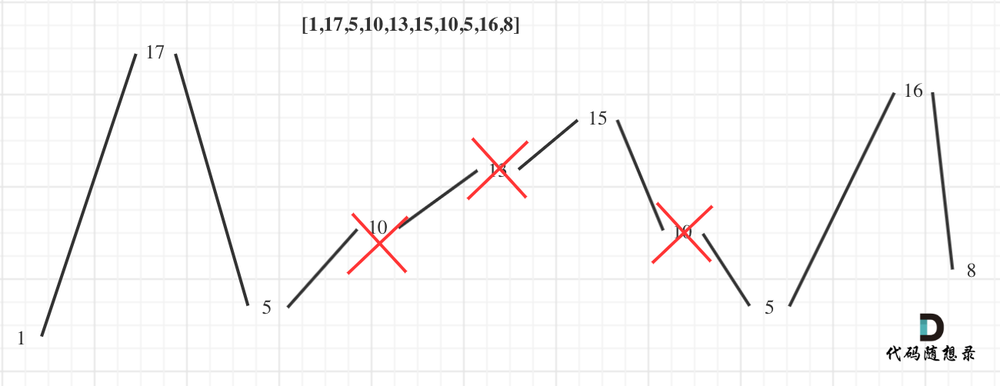
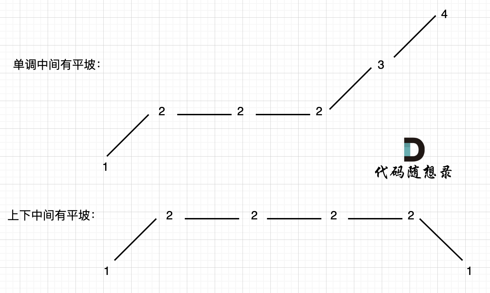

# 贪心算法

### 基本概念

贪心：**贪心的本质是选择每一阶段的局部最优，从而达到全局最优**。

贪心使用场景：**刷题或者面试的时候，手动模拟一下感觉可以局部最优推出整体最优，而且想不到反例，那么就试一试贪心**。

#### 贪心一般解题步骤

贪心算法一般分为如下四步：

- 将问题分解为若干个子问题
- 找出适合的贪心策略
- 求解每一个子问题的最优解
- 将局部最优解堆叠成全局最优解

这个四步其实过于理论化了，我们平时在做贪心类的题目 很难去按照这四步去思考，真是有点“鸡肋”。

做题的时候，只要想清楚 **局部最优** 是什么，如果推导出**全局最优**，其实就够了。

### 相关算法

- [分发饼干](https://leetcode.cn/problems/assign-cookies/)
- [摆动序列](https://leetcode.cn/problems/wiggle-subsequence/)
- [最大子数组和](https://leetcode.cn/problems/maximum-subarray/)
- [买卖股票的最佳时机 II](https://leetcode.cn/problems/best-time-to-buy-and-sell-stock-ii/)
- [跳跃游戏](https://leetcode.cn/problems/jump-game/)
- [跳跃游戏 II](https://leetcode.cn/problems/jump-game-ii/)
- [K 次取反后最大化的数组和](https://leetcode.cn/problems/maximize-sum-of-array-after-k-negations/)
- [加油站](https://leetcode.cn/problems/gas-station/)
- [分发糖果](https://leetcode.cn/problems/candy/)
- [柠檬水找零](https://leetcode.cn/problems/lemonade-change/)
- [根据身高重建队列](https://leetcode.cn/problems/queue-reconstruction-by-height/)
- [用最少数量的箭引爆气球](https://leetcode.cn/problems/minimum-number-of-arrows-to-burst-balloons/)
- [无重叠区间](https://leetcode.cn/problems/non-overlapping-intervals/)
- [划分字母区间](https://leetcode.cn/problems/partition-labels/)
- [合并区间](https://leetcode.cn/problems/merge-intervals/)
- [单调递增的数字](https://leetcode.cn/problems/monotone-increasing-digits/)
- [监控二叉树](https://leetcode.cn/problems/binary-tree-cameras/)

#### [分发饼干](https://leetcode.cn/problems/assign-cookies/)

- 每人分一个饼干，大尺寸优先给胃口大的孩子。

```c++
class Solution {
public:
    int findContentChildren(vector<int>& g, vector<int>& s) {
        sort(g.begin(), g.end());
        sort(s.begin(), s.end());
        int index = s.size() - 1;
        int ret = 0;
        for(int i = g.size() - 1; i >= 0; i--)
        {
            if(index >= 0 && s[index] >= g[i])
            {
                ret++;
                index--;
            }
        }

        return ret;
    }
};
```

#### [摆动序列](https://leetcode.cn/problems/wiggle-subsequence/)

- **局部最优：删除单调坡度上的节点（不包括单调坡度两端的节点），那么这个坡度就可以有两个局部峰值**。
- **整体最优：整个序列有最多的局部峰值，从而达到最长摆动序列**。



- 两种平坡情况:
- 情况1：允许prediff == 0 
- 情况2：只需要在 这个坡度 摆动变化的时候，更新 prediff 就行，这样 prediff 在 单调区间有平坡的时候 就不会发生变化，造成我们的误判。



```c++
class Solution {
public:
    int wiggleMaxLength(vector<int>& nums) {
        if(nums.size() <= 1)    return nums.size();

        int ret = 1;
        int prediff = 0;
        int curdiff = 0;
        for(int i = 0; i < nums.size() - 1; i++)
        {
            curdiff = nums[i + 1] - nums[i];
            if((prediff >= 0 && curdiff < 0) || (prediff <= 0 && curdiff > 0))
            {
                ret++;
                prediff = curdiff;
            }
        }

        return ret;
    }
};
```

#### [最大子数组和](https://leetcode.cn/problems/maximum-subarray/)

- 局部最优：当前**连续和**为负数的时候立刻放弃，从下一个元素重新计算**连续和**，因为负数加上下一个元素**连续和**只会越来越小。
- 全局最优：选取最大**连续和**

```c++
class Solution {
public:
    int maxSubArray(vector<int>& nums) {
        int ret = INT32_MIN;
        int sum = 0;
        for(int i = 0; i < nums.size(); i++)
        {
            sum += nums[i];
            if(sum > ret)
            {
                ret = sum;
            }
            if(sum <= 0)
            {
                sum = 0;
            }
        }

        return ret;
    }
};
```

#### [买卖股票的最佳时机 II](https://leetcode.cn/problems/best-time-to-buy-and-sell-stock-ii/)

- **局部最优：收集每天的正利润**
- **全局最优：求得最大利润**。


```c++
class Solution {
public:
    int maxProfit(vector<int>& prices) {
        int ret = 0;
        for(int i = 0; i < prices.size() - 1; i++)
        {
            ret += max(prices[i + 1] - prices[i], 0);
        }

        return ret;
    }
};
```

#### [跳跃游戏](https://leetcode.cn/problems/jump-game/)

- **贪心算法局部最优解：每次取最大跳跃步数（取最大覆盖范围）**
- **整体最优解：最后得到整体最大覆盖范围，看是否能到终点**


```c++
class Solution {
public:
    bool canJump(vector<int>& nums) {
        int cover = 0;
        if(nums.size() == 1) return true;
        for(int i = 0; i <= cover; i++)
        {
            cover = max(i + nums[i], cover);
            if(cover >= nums.size() - 1) return true;
        }

        return false;
    }
};
```

#### [跳跃游戏 II](https://leetcode.cn/problems/jump-game-ii/)

- 局部最优：当前可移动距离尽可能多走，如果还没到终点，步数再加一。
- 整体最优：一步尽可能多走，从而达到最少步数。
- **统计两个覆盖范围，当前这一步的最大覆盖和下一步最大覆盖**。

```c++
class Solution {
public:
    int jump(vector<int>& nums) {
        int ret = 0;
        int curDistance = 0;
        int nextDistance = 0;
        for(int i = 0; i < nums.size() - 1; i++)    //一定是可以到达终点的
        {
            nextDistance = max(nextDistance, nums[i] + i);
            if(i == curDistance)
            {
                ret++;
                curDistance = nextDistance;
            }
        }

        return ret;
    }
};
```

#### [K 次取反后最大化的数组和](https://leetcode.cn/problems/maximize-sum-of-array-after-k-negations/)

- 贪心：按照绝对值从大到小排序，优先将负数变正，如果 *k* 还有剩余，且 k % 2 == 1再反转最小的正数

```c++
class Solution {
public:
    static bool cmp(int a, int b)
    {
        return abs(a) > abs(b);
    }

    int largestSumAfterKNegations(vector<int>& nums, int k) {
        sort(nums.begin(), nums.end(), cmp);
        int ret = 0;
        for(int i = 0; i < nums.size() && k > 0; i++)
        {
            if(nums[i] < 0)
            {
                nums[i] *= -1;
                k--;
            }
        }
        if(k % 2 == 1) nums[nums.size() - 1] *= -1;
        for(int j : nums)
        {
            ret += j;
        }

        return ret;
    }
};
```

#### [加油站](https://leetcode.cn/problems/gas-station/)

- 情况一：如果gas的总和小于cost总和，那么无论从哪里出发，一定是跑不了一圈的
- 情况二：rest[i] = gas[i]-cost[i]为一天剩下的油，i从0开始计算累加到最后一站，如果累加没有出现负数，说明从0出发，油就没有断过，那么0就是起点。
- 情况三：如果累加的最小值是负数，汽车就要从非0节点出发，从后向前，看哪个节点能把这个负数填平，能把这个负数填平的节点就是出发节点。

```c++
class Solution {
public:
    int canCompleteCircuit(vector<int>& gas, vector<int>& cost) {
        int curSum = 0;
        int min = INT_MAX;

        for(int i = 0; i < gas.size(); i++)
        {
            int rest = gas[i] - cost[i];
            curSum += rest;
            if(curSum < min) min = curSum;
        }

        if(curSum < 0)  return -1;
        if(min >= 0) return 0;

        for(int i = gas.size() - 1; i >= 0; i--)
        {
            int rest = gas[i] - cost[i];
            min += rest;
            if(min >= 0) return i;
        }

        return -1;
    }
};
```

------

方法2

- **局部最优：当前累加rest[i]的和curSum一旦小于0，起始位置至少要是i+1，因为从i之前开始一定不行。**
- **全局最优：找到可以跑一圈的起始位置**。

```c++
class Solution {
public:
    int canCompleteCircuit(vector<int>& gas, vector<int>& cost) {
        int curSum = 0;
        int start = 0;
        int totalSum = 0;
        for(int i = 0; i < gas.size(); i++)
        {
            int rest = gas[i] - cost[i];
            curSum += rest;
            totalSum += rest;
            if(curSum < 0)
            {
                start = i + 1;
                curSum = 0;
            }
        }

        if(totalSum < 0) return -1;

        return start;
    }
};
```

#### [分发糖果](https://leetcode.cn/problems/candy/)

- 确定一边之后，再确定另一边，例如比较每一个孩子的左边，然后再比较右边，**如果两边一起考虑一定会顾此失彼**。
- 一次是从左到右遍历，只比较右边孩子评分比左边大的情况。
- 一次是从右到左遍历，只比较左边孩子评分比右边大的情况。

```c++
class Solution {
public:
    int candy(vector<int>& ratings) {
        int size = ratings.size();
        int ret = 0;
        vector<int> candy(size, 1);

        for(int i = 1; i < size; i++)
        {
            if(ratings[i] > ratings[i - 1])
                candy[i] = candy[i - 1] + 1;
        }

        for(int i = size - 2; i >= 0; i--)
        {
            if(ratings[i] > ratings[i + 1])
                candy[i] = max(candy[i], candy[i + 1] + 1);
        }

        for(auto i : candy) ret += i;

        return ret;
    }
};
```

#### [柠檬水找零](https://leetcode.cn/problems/lemonade-change/)

- **因为美元10只能给账单20找零，而美元5可以给账单10和账单20找零，美元5更万能！**
- 局部最优：遇到账单20，优先消耗美元10，完成本次找零。
- 全局最优：完成全部账单的找零。

```c++
class Solution {
public:
    bool lemonadeChange(vector<int>& bills) {
        int five = 0;
        int ten = 0;
        for(auto val : bills)
        {
            if(val == 5) five++;
            
            if(val == 10)
            {
                if(five > 0) five--, ten++;
                else return false;    
            }

            if(val == 20)
            {
                if(ten > 0 && five > 0) five--, ten--;
                else if(five > 3) five -= 3;
                else return false;
            }
        }
        
        return true;
    }
};
```

#### [根据身高重建队列](https://leetcode.cn/problems/queue-reconstruction-by-height/)

- 从两个维度进行贪心
- 局部最优：优先按身高高的people的k来插入。插入操作过后的people满足队列属性
- 全局最优：最后都做完插入操作，整个队列满足题目队列属性
- 对vector进行插入操作是很费时间的，如果插入元素大于预先普通数组大小，vector底部会有一个扩容的操作，即申请两倍于原先普通数组的大小，然后把数据拷贝到另一个更大的数组上。
- 使用list优化插入操作

```c++
class Solution {
public:
    static bool cmp(const vector<int>& a, const vector<int>& b)
    {
        if(a[0] == b[0]) return a[1] < b[1];
        return a[0] > b[0];
    }

    vector<vector<int>> reconstructQueue(vector<vector<int>>& people) {
        vector<vector<int>> ret;
        sort(people.begin(), people.end(), cmp);
        for(int i = 0; i < people.size(); i++)
        {
            int position = people[i][1];
            ret.insert(ret.begin() + position, people[i]);
        }

        return ret;
    }
};
```

```c++
class Solution {
public:
    static bool cmp(const vector<int>& a, const vector<int>& b)
    {
        if(a[0] == b[0]) return a[1] < b[1];
        return a[0] > b[0];
    }

    vector<vector<int>> reconstructQueue(vector<vector<int>>& people) {
        list<vector<int>> ret;
        sort(people.begin(), people.end(), cmp);
        for(int i = 0; i < people.size(); i++)
        {
            int position = people[i][1];
            list<vector<int>>::iterator it = ret.begin();
            while(position--) it++;
            ret.insert(it, people[i]);
        }

        return vector<vector<int>>(ret.begin(), ret.end());
    }
};
```

[vector插入元素耗时大的原因](https://www.programmercarl.com/根据身高重建队列（vector原理讲解）.html)

#### [用最少数量的箭引爆气球](https://leetcode.cn/problems/minimum-number-of-arrows-to-burst-balloons/)

- 局部最优：当气球出现重叠，一起射，所用弓箭最少。全局最优：把所有气球射爆所用弓箭最少。

- 按start排序，更新最小右边界，当start超过最小右边界时，说明无法再重叠了需要额外使用一支箭

```c++
class Solution {
public:
    static bool cmp(const vector<int>& a, const vector<int>& b)
    {
        return a[0] < b[0];
    }

    int findMinArrowShots(vector<vector<int>>& points) {
        int ret = 1;
        sort(points.begin(), points.end(), cmp);

        for(int i = 1; i < points.size(); i++)
        {
            if(points[i][0] > points[i - 1][1])
            {
                ret++;
            }
            else 
            {
                points[i][1] = min(points[i - 1][1], points[i][1]);
            }
        }

        return ret;
    }
};
```

#### [无重叠区间](https://leetcode.cn/problems/non-overlapping-intervals/)

- 逆向思维：删除最少元素达到最多不重叠区间 = 区间总数 - 最多不重叠区间数
- 按右边界排序,计算最多不重叠区间数即可

```c++
class Solution {
public:
    static bool cmp(const vector<int>& a, const vector<int>& b)
    {
        return a[1] < b[1];
    }

    int eraseOverlapIntervals(vector<vector<int>>& intervals) {
        if(intervals.size() == 0) return 0;
        int count = 1;  //非交叉数量
        sort(intervals.begin(), intervals.end(), cmp);

        int minright = intervals[0][1];
        for(int i = 1; i < intervals.size(); i++)
        {
            if(intervals[i][0] >= minright)
            {
                count++;
                minright = intervals[i][1];
            }
        }

        return intervals.size() - count;
    }
};
```

- 左边界排序，计算重叠区间数量

```c++
class Solution {
public:
    static bool cmp(const vector<int>& a, const vector<int>& b)
    {
        return a[0] < b[0];
    }

    int eraseOverlapIntervals(vector<vector<int>>& intervals) {
        if(intervals.size() == 0) return 0;
        int count = 0;  //交叉数量
        sort(intervals.begin(), intervals.end(), cmp);

        for(int i = 1; i < intervals.size(); i++)
        {
            if(intervals[i][0] < intervals[i - 1][1])
            {
                count++;
                intervals[i][1] = min(intervals[i][1], intervals[i - 1][1]);
            }
        }

        return count;
    }
};
```

#### [划分字母区间](https://leetcode.cn/problems/partition-labels/)

- 贪心策略：让每个合法子串最短，全局最优就是分割的子串数量最多。

- 如何把同一个字母的都圈在同一个区间里呢？
- **找到之前遍历过的所有字母的最远边界，说明这个边界就是分割点了**。此时前面出现过所有字母，最远也就到这个边界了。
- 统计每一个字符最后出现的位置
- 从头遍历字符，并更新字符的最远出现下标，如果找到字符最远出现位置下标和当前下标相等了，则找到了分割点

```c++
class Solution {
public:
    vector<int> partitionLabels(string s) {
        int hash[26] = {0};
        vector<int> ret;

        for(int i = 0; i < s.size(); i++)
        {
            hash[s[i] - 'a'] = i;
        }
        
        int left = 0;
        int right = 0;
        for(int i = 0; i < s.size(); i++)
        {
            right = max(right, hash[s[i] - 'a']);
            if(right == i)
            {
                ret.push_back(right - left + 1);
                left = i + 1;
            }
        }

        return ret;
    }
};
```

#### [合并区间](https://leetcode.cn/problems/merge-intervals/)

- 还是判断重叠区间问题。与上面两题有着异曲同工之妙。
- 如果重叠就更新左右边界，合并为新区间。
- 如何合并更新区间边界：左边界取最小、右边界取最大(贪心策略，合并最多重叠区间)

```c++
class Solution {
public:
    vector<vector<int>> merge(vector<vector<int>>& intervals) {
        vector<vector<int>> ret;
        sort(intervals.begin(), intervals.end(), [](const vector<int>& a, const vector<int>& b){
            return a[0] < b[0];
        });
        
        ret.push_back(intervals[0]);
        for(int i = 1; i < intervals.size(); i++)
        {
            if(intervals[i][0] > ret.back()[1])
            {
                ret.push_back(intervals[i]);
            }
            else 
            {
                ret.back()[1] = max(intervals[i][1], ret.back()[1]);
            }
        }

        return ret;
    }
};
```

#### [单调递增的数字](https://leetcode.cn/problems/monotone-increasing-digits/)

- 数值的位之间的比较转化为字符串会更容易
- 例如：98，一旦出现strNum[i - 1] > strNum[i]的情况（非单调递增），首先想让strNum[i - 1]--，然后strNum[i]给为9，这样这个整数就是89，即小于98的最大的单调递增整数。

```c++
class Solution {
public:
    int monotoneIncreasingDigits(int n) {
        string strNum = to_string(n);
        int index = strNum.size();

        for(int i = strNum.size() - 1; i > 0; i--)
        {
            if(strNum[i - 1] > strNum[i]) 
            {   
                index = i;
                strNum[i - 1]--;
            }
        }

        for(int i = index; i < strNum.size(); i++)
        {
            strNum[i] = '9';
        }

        return stoi(strNum);
    }
};
```

#### [监控二叉树](https://leetcode.cn/problems/binary-tree-cameras/)

- 局部最优：让叶子节点的父节点安摄像头，所用摄像头最少
- 整体最优：全部摄像头数量所用最少

```c++
class Solution {
public:
    int ret;

    int traversal(TreeNode* root)
    {   
        //0：无覆盖
        //1: 有摄像头
        //2: 有覆盖
        if(root == nullptr) return 2;

        int left = traversal(root->left);
        int right = traversal(root->right);

        if(left == 2 &&  right == 2) return 0;
        if(left == 0 || right == 0) 
        {
            ret++;
            return 1;
        }

        if(left == 1 || right == 1) return 2;

        return -1;
    }

    int minCameraCover(TreeNode* root) {
        ret = 0;
        //遍历结束头节点没有覆盖
        if(traversal(root) == 0) ret++;

        return ret;
    }
};
```

### 总结

贪心需要关注局部最优解和全局最优解。但思路很难一下子想出来。多学多练。

菜就多练。