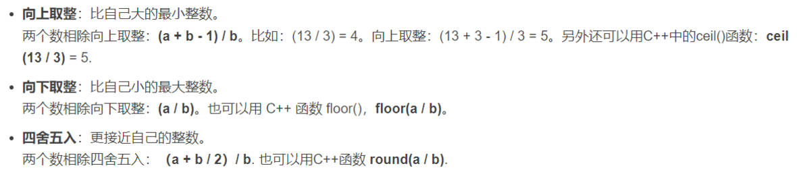

# Algorithm

算法基础题库和总结，包括数组、链表、哈希表、字符串、双指针、栈与队列、二叉树、回溯算法、贪心算法、动态规划、单调栈、图论等



```c++
#include<bits/stdc++.h>
using namespace std;
 
int main(){
    ios::sync_with_stdio(0),cin.tie(0),cout.tie(0);
 
    return 0;
}
```


```c++
#include <iostream>
#include <bits/stdc++.h>
#include <vector>
using namespace std;

int graph[1000][1000], ret[1000][1000];

int px[4], py[4];
int n, m, T;

void dfs(int x, int y, int color)
{
    ret[x][y] = color;
    for(int i = 0; i < 4; i++)
    {
        int newX = x + px[i];
        int newY = y + py[i];
        //新的x、y边界合理，且未遍历过ret[newX][newY]
        if(newX > 0 && newX < n && newY > 0 && newY < m && !ret[newX][newY])
        {
            if(graph[x][y] != graph[newX][newY])
            {
                dfs(newX, newY, color);            
            }
        }
    }
}

int main()
{
    //偏移
    px[0] = 0; px[1] = 0; px[2] = 1; px[3] = -1;
    py[0] = 1; py[1] = -1; py[2] = 0; py[3] = 0;

    int color = 1;
    cin >> n >> m >> T;
    for(int i = 1; i <= n; i++)
    {
        for(int j = 1; j <= m; j++)
        {
            cin >> graph[i][j];
        }
    }

    for(int i = 1; i <= n; i++)
    {
        for(int j = 1; j <= m; j++)
        {
            if(!ret[i][j]) dfs(i, j, ++color);
        }
    }

    for(int i =1, x1, y1, x2, y2; i <= T; i++)
    {
        cin >> x1 >> y1 >> x2 >> y2;
        if(ret[x1][y1] == ret[x2][y2]) cout << "Yes" << "\n";
        else cout << "No" << "\n";
    }
    
}
```

